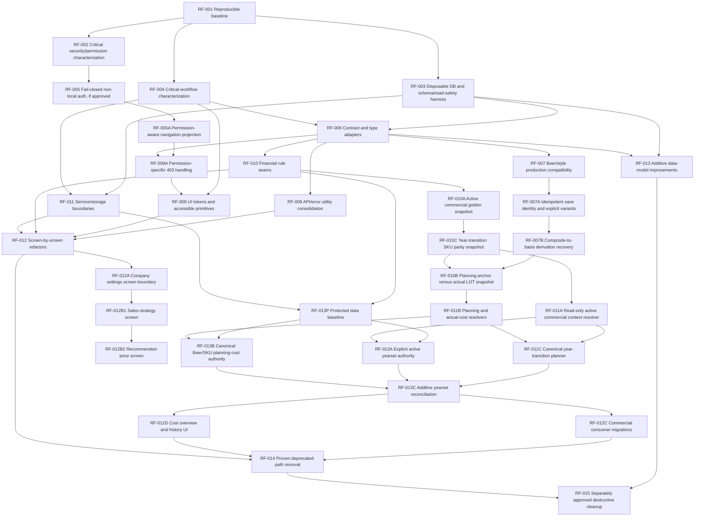
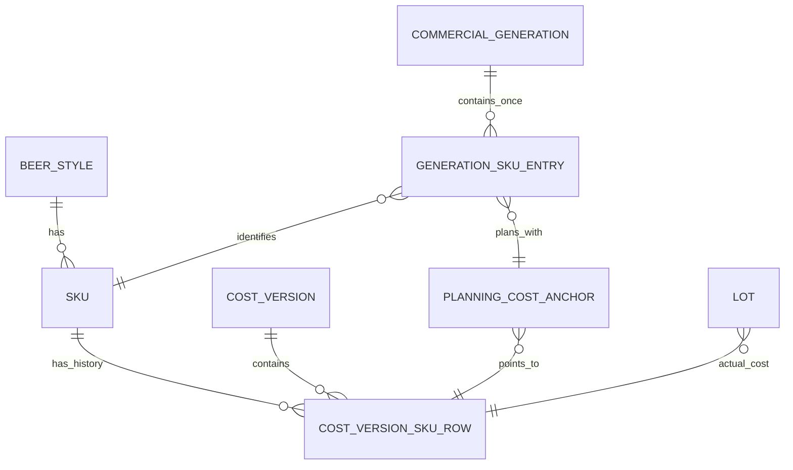

# 09 — Safe, dependency-ordered refactoring roadmap

## Roadmap principles

This is a proposed sequence, not implementation authorization. Each slice is intentionally reviewable and preserves current URLs, payloads, persisted data, external integrations and user workflows unless the slice explicitly says a product/security/data decision is required.

The roadmap distinguishes:

- **Characterisation:** tests/inventories that document current behaviour, including undesirable behaviour.
- **Refactoring:** structural change intended to preserve behaviour.
- **Behaviour correction:** a separately approved change where the current implementation conflicts with a confirmed contract.
- **Data evolution:** additive/backward-compatible work with explicit migration/rollback requirements.

No slice may use production data as its test environment. Any slice that discovers an unknown production state stops at audit/characterisation.

## Roadmap invocation and approved refinements

The RF description in this file is the scope authority for future implementation prompts. When a prompt says, for example, **implement RF-013A**, the implementation must include the approved refinement documented under RF-013 and must obey its exclusions, tests, migration strategy and dependencies.

The following rules apply:

- A parent RF identifier includes its documented sub-slices only in the dependency order stated in that RF. It does not authorize implementing all sub-slices in one branch or PR.
- A named sub-slice such as RF-010A, RF-011A or RF-013A is implemented on its own dedicated branch unless this roadmap explicitly requires two IDs to be atomic.
- Requesting a later RF does not authorize silently implementing missing predecessors. For example, RF-014 must stop if RF-010A/RF-010B/RF-011A/RF-011B/RF-013A/RF-013B and the relevant RF-012 consumer migrations have not been completed and approved.
- New refinements added after repository validation are part of the master plan even when their parent RF was written earlier.
- Existing historical quote, cost, price, break-even and sales records remain immutable unless a separately approved migration explicitly says otherwise.

Repository validation after RF-006 added three approved roadmap refinements:

1. **Permission projection correction:** backend role filtering must not be undone by frontend fallback navigation, and HTTP 403 must have a permission-specific recovery state.
2. **Active commercial context SSOT:** completing and activating a yearset must establish one explicit operational context for new work while historical records retain their original year and frozen sources.
3. **Planning cost versus actual LOT cost:** the first planning activation for a SKU and planning year is the stable planning-cost anchor used by Break-even and new Price proposals. Later purchase or brew LOTs for the same SKU create actual cost versions but do not silently replace that planning anchor. A newly introduced SKU receives its own first planning anchor. Omzet en Marge resolves actual cost from the exact LOT when available.
4. **Canonical year-transition SKU parity:** “Nieuw jaar voorbereiden” must carry the complete canonical source SKU set into a target-year candidate by stable `sku_id`, preserving Beer/format/composition identity while recalculating only named year-sensitive values. UI display rows are not a domain input. A candidate with a missing, duplicate, misclassified or non-ready required SKU must not become operational. Detailed evidence and the approved presentation/history outcome are in `16-year-transition-sku-parity-analysis.md`.
5. **Canonical yearly planning-cost list:** “basisproduct/samengesteld/variant” describes product structure and is never a synonym for membership of the operational yearly list. Every concrete SKU in the active commercial generation occurs exactly once in the canonical planning list, regardless of structural type. Immutable cost-version rows own the financial components; a planning-cost anchor points to the one version used for new planning work. Later invoice/brew versions remain history/actual evidence and do not duplicate or silently replace that anchor.

### Required execution package for RF-010

When a future prompt says **start/implement RF-010**, it means the complete RF-010 protection package:

1. RF-010 core financial golden fixtures and pure seams;
2. RF-010A active-commercial-context snapshot;
3. RF-010C source-to-target SKU parity and historical-dossier snapshot;
4. RF-010B planning-cost-anchor versus actual-LOT-cost snapshot.

They execute in that dependency order. Each remains a separately reviewable branch/PR unless the implementation prompt explicitly approves a combined tests-only branch. RF-010 is not complete until RF-010A, RF-010C and RF-010B have all been approved.

## Dependency view

## RF-001 — Reproducible baseline and test-discovery repair

- **Objective / findings:** create a noninteractive, version-pinned, all-green-or-explicitly-owned baseline. Includes TEST-001, TEST-002, TEST-003 and DATA-011 baseline evidence.
- **Included / excluded:** include Node/Python version declarations, ESLint configuration/command, exact clean install/CI reproduction, Python runner decision, correction or explicit expected disposition of the three current errors, and collection of intended LOT tests. Exclude application feature logic, schema/data changes, dependency upgrades beyond what is necessary to reproduce the lockfile, and devcontainer redesign beyond a separately reviewed tooling correction.
- **Affected screens/workflows/modules:** all indirectly; CI, manifests/config, tests and developer start instructions. Current runtime/UI behaviour must remain unchanged.
- **Contracts to preserve:** package lock resolution, CI command intent, URLs/APIs/data, existing pricing outputs and all production code behaviour.
- **Required tests:** clean checkout/install; noninteractive lint; TypeScript; eight pricing contracts; Python suite with known count; build; meta-test for discovery. E2E remains gated until RF-003 provides a safe stack.
- **Data migration:** none. Do not run seed/reset/bootstrap against persistent data.
- **Rollout / rollback / observability:** one tooling/test PR; run old and new commands in CI where possible; rollback by reverting configuration/test-only changes. CI job names, collected counts, versions and durations are the observability.
- **Acceptance criteria:** lint prompts are gone; supported Node/Python versions are declared; lockfile install is reproduced; every intended test is collected or explicitly documented as excluded; no unexplained failures; initial three errors are not silently deleted/skipped.
- **Dependencies / complexity / risk / human confirmation:** no predecessor; **medium complexity, low behavioural risk**. Test owner must decide pytest vs unittest and expected behavior behind the cost-version tests. This is the recommended first slice.

## RF-002 — Characterize authentication, sessions and permission boundaries

- **Objective / findings:** freeze current security behaviour before correction. Includes ARCH-010, ARCH-012, UI-007, DATA-010, FLOW-001/002/009 and TEST-003.
- **Included / excluded:** environment-matrix tests; route/dependency role matrix; JWT expiry/role/deactivation behavior; user case/email duplicate audit logic against fixtures; Douano diagnostic permissions. Exclude changing access, login UI, session duration, ownership or production configuration.
- **Affected screens/workflows/modules:** Login, Account, User management, all protected/admin screens, API integration; `auth_service`, `auth_dependencies`, `config_validation`, route dependencies and `AuthGate`.
- **Behaviour/contracts:** preserve current cookies, status codes, route paths, local test convenience and all observed access while characterising; never log secrets.
- **Required tests:** auth enabled/disabled × local/dev/test/staging/production; missing/invalid secret; user/admin/direct API; inactive/role-changed token; case-variant username/email; OAuth connect/probe/debug. Component/E2E checks must cover visible/hidden/denied actions.
- **Data migration:** none; production duplicate audit is read-only and separately approved by DBA/security.
- **Rollout / rollback / observability:** tests/documentation only; rollback is revert. Record route × role outcomes and request status without credential/token material.
- **Acceptance criteria:** every security boundary has an executable expected result; effective production configuration remains an explicit unknown until safely audited; product/security questions OQ-001–003 are presented with evidence.
- **Dependencies / complexity / risk / human confirmation:** depends RF-001; **medium complexity, low behavioural risk**. Security and product confirmation required before RF-005.

## RF-003 — Disposable PostgreSQL, schema lifecycle and read-purity harness

- **Objective / findings:** prove schema/data side effects safely. Includes ARCH-001/002/006, DATA-001/003/011/014, FLOW-003/016 and TEST-003.
- **Included / excluded:** disposable database fixture; DDL inventory; fresh/current/legacy schema fixtures; first/second/concurrent initialization; query/write detection for read paths; seed/reset rollback tests. Exclude production access, moving/removing DDL, running migrations, legacy cleanup and changing table structure.
- **Affected screens/workflows/modules:** all DB-backed screens; dashboard first load, quote access, setup/reset; every `ensure_schema` and `postgres_storage` transaction path.
- **Behaviour/contracts:** preserve all current SQL and responses inside isolated fixtures, including documenting destructive outcomes; no persistent data may be targeted.
- **Required tests:** fresh DB; each known legacy quote shape; dashboard GET mutation detection; repeated/concurrent init; schema diff; seed/reset empty/populated/FK rollback; transaction and connection release.
- **Data migration:** none. Test fixture schemas are disposable artifacts, not migrations.
- **Rollout / rollback / observability:** CI-only database containers with unique databases and destructive-operation guard; capture schema diff and row-count hashes. Revert harness if necessary; it must never accept a non-test database URL.
- **Acceptance criteria:** test code refuses non-disposable targets; every runtime DDL statement has an owner/test; destructive quote path is reproducible only in disposable fixtures; read-side writes are enumerated; seed/reset result is deterministic.
- **Dependencies / complexity / risk / human confirmation:** depends RF-001; **large complexity, low production risk if isolation guard is proven**. DBA confirms fixture safety; no product decision yet.

## RF-004 — Critical workflow failure/concurrency characterization

- **Objective / findings:** capture durable boundaries and recovery. Includes FLOW-004/006/008/010/012/014/015/019, ARCH-008/011, DATA-003/005/006/008/009/013 and TEST-003.
- **Included / excluded:** failure injection after each stage, duplicate submit, two-connection races, rerun/idempotency and partial-result fixtures for cost, quote, sync, LOT, year close/new year and ORS. Exclude changing transaction boundaries, background jobs, retries or UI copy.
- **Affected screens/workflows/modules:** SCREEN-013–016, 019/020, 025/026, 035/038; relevant route/service/storage/client code.
- **Behaviour/contracts:** preserve request order, status/copy, current partial states, quote number format, finality, source fingerprints, imports and external-call sequence while tests document them.
- **Required tests:** exact per-finding tests in `08-findings-register.md`; unit for pure stages, disposable-DB integration for commits/races, API for status/contracts and E2E for duplicate/cancel/retry.
- **Data migration:** none. Use anonymized production-shaped fixtures only after governance approval.
- **Rollout / rollback / observability:** test-only PRs grouped by workflow, not one mega-PR; record transaction/run stage and request ID in test logs. Revert individual fixtures if assumptions are wrong, not production logic.
- **Acceptance criteria:** each user action has a diagrammed durable boundary, expected state after every injected failure, approved retry/cancel expectation and regression test; strong new-year transaction remains green.
- **Dependencies / complexity / risk / human confirmation:** depends RF-001/RF-003 for DB tests; **large complexity, low behavioural risk**. Domain/operations owners must validate whether partial success is intentional.

## RF-005 — Fail closed in non-local environments, if explicitly approved

- **Objective / findings:** correct ARCH-012 after its deployment exposure and intended modes are confirmed; align UI-007 only where role policy is approved.
- **Included / excluded:** environment-bounded no-auth convenience, startup rejection in staging/production, explicit config diagnostics and deployment documentation. Optionally correct specifically approved endpoint roles. Exclude new identity provider, tenancy, quote ownership, immediate JWT revocation and unrelated UI redesign.
- **Affected screens/workflows/modules:** all routes; `auth_service`, `auth_dependencies`, `config_validation`, examples/deploy config; possibly integration endpoint dependencies.
- **Behaviour/contracts:** local/test explicit no-auth remains available; authenticated cookie/API behavior and 401/403 shapes stay compatible; deployment must not silently start insecurely.
- **Required tests:** RF-002 matrix, local startup, staging/prod missing flag/secret, user/admin routes, CI environment and rollback config. E2E login and role flows.
- **Data migration:** none.
- **Rollout / rollback / observability:** deploy first to isolated acceptance with an explicit enabled flag; startup metric/log assertion and synthetic authenticated/unauthenticated probes; rollback code only if config remains secure—never rollback to silent fail-open without incident approval.
- **Acceptance criteria:** non-local missing/false auth cannot produce admin access; local/test behavior is explicit; operational runbook and secret/config validation are current; all role outcomes approved.
- **Dependencies / complexity / risk / human confirmation:** RF-002; **small/medium complexity, high rollout/security risk**. Mandatory security/operations/product approval.

### RF-005A — Permission-aware navigation projection

- **Objective / classification:** correct the observed UI projection defect without changing the approved role matrix. This is a bounded **behaviour correction** for ARCH-007/UI-007 after RF-005.
- **Observed evidence:** backend `meta.get_navigation` removes `prijsvoorstel` when `quotes:manage` is absent, but `NavigationSidebar.buildNavGroups` adds `/prijsvoorstellen` back from its fallback list. A Brewer can therefore see and open a route that the backend correctly rejects with HTTP 403.
- **Included / excluded:** remove or capability-scope only the fallback entries that reintroduce backend-hidden routes; characterize the complete sidebar per approved role; preserve direct-route backend denial. Exclude granting new capabilities, changing the role matrix, quote ownership, redesigning navigation, or weakening backend authorization.
- **Affected screens/workflows/modules:** all sidebar screens; specifically `/prijsvoorstellen`, backend navigation, `NavigationSidebar`, and role-visibility E2E tests.
- **Behaviour/contracts:** Administrator/Management/Sales keep quote access; Brewer does not see quote navigation and still receives 403 on a direct request. Backend remains the security authority.
- **Required tests:** backend navigation role matrix; rendered sidebar route matrix for every supported role; direct URL and direct API 403; login/session expiry; regression that frontend fallback entries cannot bypass hidden backend descriptors.
- **Data migration:** none.
- **Rollout / rollback / observability:** one corrective branch/PR; rollback restores the prior projection but never changes backend denial. Record only role/capability/status, never identity or payload data.
- **Acceptance criteria:** no role sees a protected navigation item absent from its backend navigation projection; direct denial remains intact; all existing allowed routes remain visible.
- **Dependencies / complexity / risk / human confirmation:** RF-002/RF-005; **small complexity, low data risk, medium workflow trust risk**. The approved role matrix is the product authority.

## RF-006 — Boundary contract inventory and one end-to-end typed adapter

- **Objective / findings:** clarify types without changing JSON. Includes DATA-002/004/005/009/012, CODE-003, ARCH-005/006 and quote DELETE response mismatch.
- **Included / excluded:** executable contract registry; request/response snapshots; permissive runtime parsers preserving aliases/unknown fields; type one low-risk entity path end to end; align a false frontend response type only where callers do not depend on it. Exclude schema changes, strict rejection, renaming, generated-client rollout and financial rule changes.
- **Affected screens/workflows/modules:** begin with a bounded read or quote list/delete adapter; later dataset registry. All external URLs and fields remain unchanged.
- **Behaviour/contracts:** byte/semantic serialization, null/default/unknown-field behavior, status codes and compatibility aliases must remain.
- **Required tests:** DB/API/TS round-trip fixtures, future/legacy schema versions, unknown fields, malformed-but-currently-tolerated payloads, compile-time response fixtures and OpenAPI snapshots.
- **Data migration:** none.
- **Rollout / rollback / observability:** one entity/endpoint per PR; compare parsed/raw shapes and count deviations in test/acceptance without logging sensitive payloads; revert adapter while retaining fixtures.
- **Acceptance criteria:** chosen path has one documented source/adapter chain; no payload diff; deviations are visible rather than coerced silently; no increased rejection rate.
- **Dependencies / complexity / risk / human confirmation:** RF-003/RF-004; **medium complexity, low/medium risk**. Data/domain owner validates field semantics.

## RF-007 — Repair the production beer/style save compatibility path

- **Objective / findings:** narrowly correct ARCH-011 and its FLOW-006 partial failure using the existing item/ETag API.
- **Included / excluded:** replace only `BerekeningenWizard.saveBierenRows` collection PUT with characterized reconciliation or a purpose-built compatible command; preserve beer-family synchronization and activation ordering. Exclude disabling the global production guard, changing cost formulas, generic editor rewrites or packaging-price behavior (it is exempt).
- **Affected screens/workflows/modules:** SCREEN-013/015; cost save/finalize; `BerekeningenWizard`, dataset item client, backend dataset contract.
- **Behaviour/contracts:** same URL-visible workflow, version status, beer IDs/fields, messages and optional activation outcome; the correction is that production-mode no longer returns the known 405 after version save.
- **Required tests:** production-mode API/component, pre-existing partial state and retry, Nth-item failure, ETag conflict, new/update/delete beer, projection sync, finalize/activation order; existing cost/pricing contracts.
- **Data migration:** none; no repair of existing partial records without separate audit/approval.
- **Rollout / rollback / observability:** feature-specific PR; acceptance first; monitor 405/409/error and partial-finalization counts; rollback client change, not backend safety gate. Provide manual reconciliation runbook for pre-existing partial state.
- **Acceptance criteria:** production-mode save/finalize succeeds for characterized cases; concurrency conflicts are explicit; no collection guard change; data before/after matches expected item reconciliation.
- **Dependencies / complexity / risk / human confirmation:** RF-004/RF-006; **medium complexity, medium risk**. Domain owner confirms desired partial-retry behavior; this is a behavior correction and needs explicit approval.

### RF-007A — Idempotent beer identity, targeted saves and explicit variant projection

- **Objective / classification:** amend RF-007 so a new Beer identity is written into the cost version before persistence, partial retries reuse the same identity, and only variants explicitly created for that Beer flow through Variants, Coupling and Summary. This is a bounded behaviour correction.
- **Included / excluded:** targeted Beer item persistence; direct create with safe conflict-to-ETag retry; one stable `beer_id` in top-level and basis data; non-empty Beer scoping plus explicit Beer-format BOM relation for saved variants; busy/spinner feedback and navigation lock while saving. Exclude composite-to-basis cost derivation, formulas, activation policy, schema changes, automatic data repair and generic performance redesign.
- **Preserved contracts:** existing/historical cost versions and Beer/SKU/BOM data are not deleted or rewritten; cost-version save remains before Beer-style persistence and optional activation; pricing and rounding outputs remain exact.
- **Required tests:** known-new create without expected 404; existing ETag update; partial-response retry without duplicate Beer; Beer ID parity between master and cost version; empty Beer ID cannot select global article SKUs; identical explicit variant projection in Variants/Coupling/Summary; accessible busy state.
- **Known accepted limitation:** backend Beer item persistence still loads and saves the JSON-backed Beer aggregate. Manual acceptance may find save latency noticeable. Measure before changing storage; table-backed Beer evolution belongs RF-013B, with service/performance seams under RF-011B.
- **Status / acceptance evidence:** implemented on the RF-007 draft branch and manually accepted for save, retry, variant projection and navigation feedback. Activation acceptance remains blocked until RF-007B restores the required basis-product derivation.

### RF-007B — Restore and protect composite-to-basis product derivation

- **Objective / classification:** restore the approved wizard rule that a selected composed product exposes its Beer basis-product children for costing, SKU creation and first-time activation. This is a financial behaviour correction and must be snapshot-protected.
- **Approved behaviour:** when a composed purchase product such as `Doos 24 x 33cl` is selected, the composed product remains visible and its linked Beer basis product such as `Fles 33cl` is shown under Basis products. Sellable variants remain empty until the user explicitly creates them. The exact product/variant set then flows through Coupling, Summary and activation.
- **Included / excluded:** derivation/projection only for the characterized composite and basis relations; deterministic child ordering and de-duplication; manual acceptance using a test Beer such as Juweel; first-time SKU activation test. Exclude changing cost formulas, planning-anchor replacement rules, LOT actual-cost resolution, Beer schema evolution, historical record rewrites and broad product-model cleanup.
- **Current behaviour that must remain:** existing master records, cost versions, SKU IDs, URLs, invoice payloads and historical costs remain untouched. RF-007A identity/retry/variant protections remain active.
- **Required characterization tests:** pre-change SKU cost snapshot; selected composed product with one/multiple basis children; packaging-only child exclusion; missing/invalid relation; duplicate child reference; explicitly created variant only; Coupling/Summary set parity; first-time new SKU activation; existing SKU not silently re-anchored; full pricing contracts.
- **Acceptance criteria:** basis children appear as approved; calculated SKU costs either match the approved snapshot exactly or every difference is stopped and explained; Juweel can complete the wizard and activate the newly introduced SKU; no existing SKU planning cost or historical LOT cost changes.
- **Dependencies / complexity / risk / human confirmation:** RF-007A and RF-004/RF-006; **medium/large complexity, high financial risk**. Product/finance must approve the before/after product set and cost-price snapshot before merge.

## RF-008 — Consolidate one API/error utility at a time

- **Objective / findings:** address ARCH-009, CODE-004/008 and UI-006 without global transport replacement.
- **Included / excluded:** common error metadata/parser; first one read-only screen, then one idempotent mutation; preserve current specialized timeout where intentional. Exclude automatic write retry, all-call-site conversion, copy redesign and server error schema changes.
- **Affected screens/workflows/modules:** choose low-risk SCREEN-005/012 or a settings read before financial workflows; `apiClient`, relevant direct fetch and local status component.
- **Behaviour/contracts:** exact URL, cookies, headers, timeout/cancel semantics, response body and visible messages must remain for the migrated call.
- **Required tests:** all HTTP/network/timeout/abort cases; stale response; cookie forwarding; UI retry/empty/status; mutation duplicate prevention.
- **Data migration:** none.
- **Rollout / rollback / observability:** one call family per PR; capture request ID/status category in acceptance logs; rollback individual adapter call. No sensitive response body telemetry.
- **Acceptance criteria:** selected screens have identical success/copy behavior, tested failure semantics and preserved request metadata; no global retry introduced.
- **Dependencies / complexity / risk / human confirmation:** RF-006; **small per slice, low/medium risk**. Product review only if visible copy would change—otherwise excluded.

### RF-008A — Permission-specific 403 handling for one protected read route

- **Objective / classification:** distinguish authentication failure, authorization failure and unexpected failure without globally replacing every API client. This is a bounded **behaviour correction** for ARCH-009/UI-006/UI-007.
- **Included / excluded:** add structured status/category metadata to the server read helper; migrate the quote overview/direct route first; map 401 to login, 403 to access denied, and unexpected/network failures to the existing error path. Exclude automatic retry, mutation retry, backend error-schema redesign, or migrating all fetch clients.
- **Behaviour/contracts:** request URL, cookies, timeout, backend status and permission policy remain unchanged. Technical response bodies and stack details are not shown by default.
- **Required tests:** 200/401/403/404/422/500/network/timeout; cookie forwarding; direct URL; session expiry; no retry loop; safe recovery links.
- **Data migration:** none.
- **Acceptance criteria:** a user without quote capability receives an explicit access-denied state rather than “Er ging iets mis”; an unauthenticated user still reaches login; unexpected failures remain distinguishable and diagnosable.
- **Dependencies / complexity / risk / human confirmation:** RF-005A/RF-006; **small complexity, low data risk**. Product approves visible access-denied copy.

## RF-009 — UI tokens and accessible primitive behavior, one family at a time

- **Objective / findings:** improve/consolidate UI-001–004/006/008/010 while preserving visual identity.
- **Included / excluded:** token inventory; visible focus, names, status announcements; one headless dialog/tab/table behavior under existing styles; representative visual tests. Exclude redesign, universal table, every dialog/class rename, shell changes and new breakpoints without evidence.
- **Affected screens/workflows/modules:** begin with one low-risk dataset editor/settings flow; later a non-destructive dialog; preserve CPQ/analytics families until separately characterized.
- **Behaviour/contracts:** layout, text, action order, validation, save/cancel and responsive behavior remain; non-visual accessibility semantics may improve after approval.
- **Required tests:** visual snapshots at agreed widths, axe/manual keyboard, accessible names/live status, focus entry/trap/return/Escape, cancel/no-write and edit semantics.
- **Data migration:** none.
- **Rollout / rollback / observability:** component-family PRs and screenshot review; accessibility test results plus user feedback; rollback primitive adoption per screen, not global CSS reset.
- **Acceptance criteria:** selected primitive has one documented interaction contract, no visual/workflow regression, WCAG-relevant checks pass and intentional exceptions are documented.
- **Dependencies / complexity / risk / human confirmation:** RF-001/RF-004; **medium complexity, medium risk**. Accessibility review required; product/design required for visible changes/dialog policies.

### RF-009A — Per-screen UI consistency baseline and adoption matrix

- **Objective:** combine the route inventory and cross-screen findings into one screen-by-screen decision matrix before application UI is changed.
- **Included:** current source revalidation; guarded GET-only route audit; representative desktop/mobile screenshots; accessibility/layout evidence; intentional-versus-accidental variation decisions; priority and implementation-family assignment for every SCREEN ID.
- **Excluded:** application source/style changes, visual redesign, workflow changes, permission decisions, database changes and automatic remediation.
- **Deliverable:** `docs/refactor-analysis/11-ui-screen-consistency-matrix.md`.
- **Acceptance criteria:** every screen has a recommendation or explicit intentional exception; the first primitive implementation is small enough for one branch/PR; high-risk page composition is assigned to RF-012.
- **Dependency note:** RF-009A can be completed after RF-008. Permission-specific visual behavior remains excluded until RF-008A provides a typed outcome.

### RF-009B — First accessible primitive adoption

- Start only after RF-009A is reviewed.
- Recommended first family: `DatasetTableEditor` field naming and async status semantics for SCREEN-005/009/012.
- Preserve table layout, visible labels, values, pagination, row/add/delete/save behavior, API contracts and permissions.
- Explicitly exclude table redesign, dirty-form policy, delete confirmation and responsive column redesign.
- Run axe, keyboard, status, save/error and desktop/mobile screenshot regression checks.

### RF-009C — Shared action-status and busy-state pilot

- **Objective:** establish one accessible, visually consistent contract for pending, success, warning and error feedback before wider screen adoption.
- **Included:** a shared status primitive; visible spinner and descriptive pending text; semantic success/warning/error colors with icon and text; `role=status` / `role=alert`; duplicate-submit prevention; actionable recovery guidance where the persistence outcome is known or explicitly uncertain.
- **Pilot screens:** SCREEN-004 (`/account`) and SCREEN-029 (`/instellingen/bedrijf`). Save feedback remains beside the relevant form actions.
- **Preserve:** request methods, URLs, payloads, password and settings validation, field values, save boundaries, settings-change event, refresh behavior, permissions and persisted data.
- **Excluded:** table sorting, navigation/action placement, dialogs, tabs, global error boundaries, financial screens, automatic retries and adoption by every screen.
- **Required tests:** desktop/mobile pending, success and error states; accessible announcement; contrast; spinner and busy relationship; duplicate-submit protection; validation failure; uncertain-outcome copy; intercepted mutations proving that browser tests do not change passwords or settings.
- **Data migration:** none.
- **Acceptance:** both pilots use the same status owner and action-area placement; users can distinguish progress, success and failure without color alone; errors provide a safe next step without exposing raw technical details.

### RF-009D / RF-009E — Deferred tab and dialog pilots

- RF-009D remains a separately approved tab-behavior pilot, beginning with SCREEN-037 and expanding only where workflow tests permit.
- RF-009E remains a separately approved non-destructive/read-only dialog pilot. Destructive, financial and unsaved-form dialogs remain excluded.
- Neither slice is implicitly authorized by RF-009C, RF-009F or RF-009G.

### RF-009F — Read-only and editable table interaction contract

- **Objective:** make sortable-table behavior discoverable and accessible without forcing one universal table implementation.
- **Included:** classify read-only, editable, selectable and business-ordered tables; visible inactive sortable affordance; ascending/descending state; keyboard activation; `aria-sort`; explicit client-versus-server sorting ownership.
- **Preserve:** row values, pagination, filters, API queries, manual/business order, edit/save behavior and financial meaning.
- **Excluded:** making every table sortable, sorting wizard summaries/BOM/manual-order tables, mobile table redesign and changing server query contracts.
- **Required tests:** sortable-column inventory, unchanged initial order, ascending/descending/keyboard behavior, `aria-sort`, pagination/filter interaction and desktop/mobile screenshots for each adopted table family.

### RF-009G — Navigation and form-action contract

- **Objective:** standardize the meaning and placement of `Terug`, `Vorige`, `Annuleren`, `Opslaan`, `Opslaan en sluiten`, `Volgende` and `Afronden` without changing what those actions do.
- **Page contract:** when a clear parent exists, use an explicit destination link near the page start, such as `Terug naar Kostprijsbeheer`; do not depend on ambiguous browser-history navigation.
- **Wizard contract:** place `Vorige` at the left and the secondary/primary action group at the right, with the primary continuation or completion action last. Use `Opslaan en doorgaan` when continuing also persists; use `Volgende` only when it does not imply a save.
- **Meaning:** `Annuleren` stops or discards only after characterized unsaved-change behavior; `Opslaan` persists and stays; `Opslaan en sluiten` persists and returns to the known parent. Labels must describe the actual effect.
- **Preserve:** destinations, save timing, validation, cancellation, draft behavior, dirty-state handling, permissions and workflow ordering.
- **Excluded:** repository-wide button movement, browser back replacement without a known parent, new autosave, new confirmation dialogs and high-risk wizard adoption before characterization.
- **Required tests:** exact destination/action effects, no-write cancel/back cases, dirty-state behavior, save/close navigation, keyboard order, focus after navigation and representative desktop/mobile screenshots.

RF-009C, RF-009F and RF-009G are always separate branches/PRs. Combining them is not authorized by requesting the parent RF-009.

### Permission-state UI family

- After RF-008A defines error semantics, RF-009 may introduce one accessible access-denied primitive under existing styles.
- Suggested product copy may use the Berlewalde tone, for example: “Deze tap is voor jouw rol gesloten 🍺”, followed by a clear explanation and “Naar overzicht” / “Mijn account” actions.
- Humor must not obscure the reason, required action, keyboard focus, screen-reader announcement or recovery route.
- This visual/copy slice must not decide permissions; it renders the typed permission outcome from RF-008A.

## RF-010 — Financial golden fixtures and pure business-rule seams

- **Objective / findings:** prepare safe rule consolidation for ARCH-005, CODE-002/005, DATA-005/012 and FLOW-006/008/013–015.
- **Included / excluded:** approved golden inputs/outputs; pure adapters/functions extracted from one calculation path; cross-language parity runner where both implementations exist. Exclude changing formulas, rounding, authority, stored snapshots or server enforcement.
- **Affected screens/workflows/modules:** start with one already contract-tested quote or pricing calculation, not the full cost engine; later cost/break-even/year calculations.
- **Behaviour/contracts:** every numeric output, rounding point, null/default, unit, historical and serialization result remains exact.
- **Required tests:** finance-approved fixtures, boundary/rounding/credits/zero/missing/timezone cases, TypeScript/Python parity, historical master changes and performance measurement (not assumption).
- **Data migration:** none.
- **Rollout / rollback / observability:** pure-code PR per rule family; dual-run comparison in test/acceptance, not production writes; rollback extraction by delegating to original while keeping fixtures.
- **Acceptance criteria:** one named rule has approved owner/input/output/rounding and unchanged results across old/new seam; any current divergence is reported, not silently corrected.
- **Dependencies / complexity / risk / human confirmation:** RF-004/RF-006 and OQ-009–012; **medium/large complexity, high financial risk**. Mandatory finance/product approval.

### RF-010A — Active commercial context golden snapshot

- **Objective:** establish exact regression protection for the operational-year transition before selecting or centralizing any source of truth.
- **Observed evidence to protect:** development currently contains complete 2025/2026 cost activations, 2026 selling/advice rows and an active 2026 break-even plan; consumers nevertheless choose years and price fallbacks independently. Existing quote drafts can intentionally retain an older saved year.
- **Included / excluded:** approved per-SKU fixtures for active cost/version/components, sell-in/list/channel output, advice price, new-quote output, saved historical quote output, break-even plan rows and historical actual snapshots. Exclude changing formulas, active-year selection, identifiers, selling-price policy or stored records.
- **Required cases:** every active SKU; changed/unchanged year-over-year cost; explicit keep-price, keep-margin and scale-with-cost scenarios; missing channel margin; `list` fallback; advice channels; new quote versus reopened historical quote; plan versus actual; zero/missing/rounding cases.
- **Parity rule:** capture raw source IDs and component breakdowns as well as final numbers. Differences must be classified as intentional policy, current defect or unknown; unknown differences stop implementation.
- **Data migration:** none. Fixtures use pseudonymous/anonymized development-shaped data and read-only audits.
- **Acceptance criteria:** finance/product approves the baseline meaning of cost price, selling price and advice price per context; all current outputs are reproducible; no source switch has occurred.
- **Dependencies / complexity / risk / human confirmation:** RF-004/RF-006; **medium/large complexity, high financial risk**. Mandatory finance/product approval, including confirmation of whether unchanged selling prices were intentionally selected.

**RF-010A implementation note (2026-07-20):** use a committed synthetic, development-shaped full-value fixture for CI and a committed hash-only manifest for the real development baseline. The local raw capture includes source identifiers, component breakdowns and final numbers but is piped directly through the fingerprint runner and is never committed. This preserves exact per-SKU/workflow parity without publishing commercial prices. The read-only capture currently records 35 activation/version/SKU combinations without a canonical cost row or matching stored result-snapshot row, 77 central 2026 rows versus 54 quote/break-even-ready rows, and 940 of 1,782 persisted 2026 actual order/invoice snapshots marked `missing_cost`. These are existing-state observations, not fixes; their SKU/year-transition meaning must be decided through RF-010C and their LOT-resolution meaning through RF-010B before RF-011A/RF-011B. Detailed evidence and the approval checklist are in `15-active-commercial-context-golden-snapshot.md`.

### RF-010C — Source-to-target SKU parity and historical-dossier snapshot

- **Objective / classification:** freeze the approved new-year identity contract and expose the current 2025→2026 differences before changing the writer, data model or consumers. This is read-only **characterisation**, not a data repair.
- **Observed blocker:** the current new-year calculator consumes `buildActiveRows`, a presentation projection that can fan one SKU into multiple display groups and choose presentation labels/types. The target engine rows persist that projection. Separately, the cost-version read model returns all normalized cost rows as `basisproducten` and replaces `samengestelde_producten` with an empty list. See `16-year-transition-sku-parity-analysis.md`.
- **Manifest contract:** one row per canonical source `sku_id`; Beer/subject identity; format/article identity; SKU kind; BOM/composition fingerprint; source cost-version/row and component fingerprint; liters/readiness; sales eligibility; external mapping identity; target row/version; changed-field allowlist; cost/price readiness reason; source-to-target lineage.
- **Required cases:** Juweel `Doos 24 × 33cl` and keg/non-applicable keg; working Tripel control; Blond bottle/keg/box and missing Quote option; Weizen purchase method plus “recalculated from source year” provenance; “Alles onder de boom” display references versus physical SKU rows; composed box; explicitly created variant; historical 2025 snapshot versus normalized cost rows.
- **Parity rules:** every required source SKU occurs exactly once in the target candidate under the same canonical identity; extra target SKUs are explicitly classified; composed/basis/variant meaning survives; target financial components match the approved calculation fixture; no zero/missing cost is labelled `n.v.t.`; silent Quote/Break-even exclusion is reported as a typed reason.
- **Included / excluded:** synthetic full-value CI fixtures, private alias/hash-only local comparison, pure manifest/diff utilities and tests. Exclude database writes, current 2026 repair, activation, formula changes, UI changes, SKU merge/delete, historical snapshot reconstruction and consumer switching.
- **Required tests:** duplicate UI projection; duplicate physical SKU; missing canonical cost row; zero cost; missing liters; missing sell-in; basis/composed mismatch; source/target label drift with stable ID; unknown/extra target row; one-to-many and many-to-one identity changes; original historical snapshot immutability.
- **Data migration / rollout / rollback:** none. Test/documentation branch only; private commercial values never enter Git. Rollback removes the tests/manifest utility, not source data.
- **Acceptance criteria:** every current source/target difference is classified as intended, defect or unknown; unknown identity/financial differences block RF-010B/RF-011A/RF-011C; product/finance confirms the source-to-target changed-field allowlist.
- **Dependencies / complexity / risk / human confirmation:** RF-010A/RF-007B; **medium/large complexity, low runtime risk, high financial significance**. Mandatory product/finance/data approval. RF-010 remains incomplete until RF-010C and RF-010B pass.

**RF-010C implementation note (2026-07-20):** this slice remains tests/audit/documentation only. The committed synthetic fixture covers canonical SKU uniqueness, UI fan-out, missing/extra identities, one-to-many/many-to-one lineage, composed classification, label drift, missing cost row versus non-positive cost, liters, sell-in, `n.v.t.`, provenance and historical snapshot/read-model divergence. A read-only private 2025→2026 audit records 66 unique source activations and 77 unique target activations, with 11 extra target SKUs, six UI-fan-out SKU IDs, 35 missing target cost rows, 23 sell-in-readiness gaps, 43 label changes, eight identity differences, 11 lineage mismatches and 108 of 143 historical dossier projections differing. These are baseline observations, not repairs. Unknown identity/lineage and readiness classifications block RF-011C/RF-013C; RF-010B may proceed only as the next read-only characterization slice.

### RF-010B — Planning-cost anchor versus actual LOT-cost golden snapshot

- **Objective:** freeze the approved distinction between stable planning cost and realized LOT cost before centralizing any cost resolver or changing the data model.
- **Approved planning rule:** for each concrete SKU and planning year, the first approved activation becomes the planning-cost anchor. Break-even and brand-new Price proposals use that anchor. A later purchase or brew cost version for the same SKU does not silently replace it. A SKU introduced for the first time later in the year receives its own first anchor.
- **Approved actual-cost rule:** every purchase or brew may create a new cost version and LOT. Omzet en Marge resolves the exact LOT-linked cost row when the LOT is present. Order/invoice date is not allowed to override an exact LOT match. Missing or ambiguous LOT uses only an explicitly approved, visible fallback policy.
- **Included / excluded:** read-only golden fixtures and executable characterisation for purchased Beer, own recipe, same SKU/later LOT, new SKU/later introduction, multiple formats, year transition, exact/unknown/ambiguous LOT, and explicit rebaseline. Exclude changing activations, backfilling sales, creating tables, rewriting LOTs, replacing formulas or switching consumers.
- **Required outputs:** planning SKU/year, planning cost-version and cost-row IDs, planning component breakdown; actual SKU/LOT, actual cost-version and cost-row IDs, actual component breakdown; resolver reason/source and warning state.
- **Required parity cases:** January first purchase followed by May purchase of the same SKU; May first purchase of a new SKU; first own-production format followed by later fust/packaging format; exact LOT across activation changes; missing LOT; reopened historical quote; new quote; Break-even plan; current and next planning year.
- **Acceptance criteria:** finance/product confirms that Break-even and new Price proposals select the same first planning anchor; later same-SKU LOT costs remain visible to Omzet en Marge without changing planning; new SKUs receive independent anchors; every current deviation is classified and unknown deviations block RF-011B.
- **Dependencies / complexity / risk / human confirmation:** RF-007B/RF-004/RF-006; **medium/large complexity, high financial risk**. Mandatory finance/product approval. RF-010 is incomplete until RF-010B passes.

**Implementation record (2026-07-20):** RF-010B now has executable synthetic Quote, Break-even and Omzet en Marge cases plus a guarded read-only development fingerprint baseline; see `17-planning-lot-cost-golden-snapshot.md`. No application source-selection, calculation, schema or persisted data changed. The current readers' latest-activation behavior and exact-LOT precedence are frozen. The development audit records 11 ambiguous exact LOT keys, 500 explicit LOT fallbacks and 940 missing-cost snapshots. The target resolution and explicit-rebaseline policies are now approved; item-level remediation and every consumer switch remain blocked until their named evidence gates pass.

**Approved clarification (2026-07-20):** LOT requirement and cost requirement are independent maintained classifications. A cost-bearing non-LOT SKU uses its applicable approved SKU cost; an explicitly maintained `no_cost_required` line such as an invoice rounding difference receives no invented cost and is not a missing-cost error. Missing/unknown LOT on a LOT-required SKU remains unresolved, near matches require explicit Administrator mapping, and exact ambiguity blocks. Management approves any planning rebaseline; Administrator may execute it only with that recorded approval. Item-level remediation of the 940 missing-cost snapshots and 11 ambiguities remains pending and consumer switching stays blocked.

## RF-011 — Extract one service/storage boundary while preserving public facades

- **Objective / findings:** reduce ARCH-003/004/006/008, CODE-001/008 and DATA-006–008/013 coupling through one workflow seam.
- **Included / excluded:** select one characterized operation (for example classification authority update, LOT projection reconciliation, or a read-only plan stage); add application service/result type while existing route/facade delegates. Exclude repository-wide repositories, runtime DDL removal, queue introduction, source-of-truth switch or schema cleanup.
- **Affected screens/workflows/modules:** one of SCREEN-034–038/FLOW-010–012, chosen after owner decision; exact route/storage files listed in its finding.
- **Behaviour/contracts:** route, permissions, transaction stages, external calls, result fields, retries and compatibility projections remain.
- **Required tests:** current endpoint snapshot, injected failure at each side effect, transaction/idempotency, projection parity, permissions and external stub.
- **Data migration:** none for seam extraction. Any authority change moves to RF-013.
- **Rollout / rollback / observability:** route delegates behind existing interface; optional shadow planning comparison; structured stage/result logs; rollback delegation to original function.
- **Acceptance criteria:** route contains transport/policy only for the selected operation; service can be integration-tested independently; output/side effects are identical; no unrelated module moved.
- **Dependencies / complexity / risk / human confirmation:** RF-003/004/006; **medium/large complexity, medium/high risk**. Domain/data owner selects authority and confirms semantics.

### RF-011A — Read-only active commercial context resolver

- **Objective:** introduce one read-only application/domain service for an explicit operational year while existing screens continue using their current paths.
- **Public result:** operational year candidate; planning SKU ID; planning-anchor cost-version/cost-row ID and immutable component breakdown; resolved selling price and source by channel; advice-price inputs/outputs; active break-even plan ID/generation; completeness warnings.
- **Included / excluded:** adapters over existing activation, cost-version, sales-pricing, advice-pricing and break-even stores; canonical SKU identity; shadow comparison against quote and break-even outputs. Exclude changing the active year, rewriting persisted records, modifying formulas, or switching consumers.
- **Temporal contract:** current/new work may resolve an operational context; historical quote and sales snapshots remain bound to their saved year/version/transaction context.
- **Required tests:** RF-010A/RF-010B golden fixtures; read purity; incomplete year; mismatched identifiers; multiple planning candidates; explicit price versus margin precedence; historical snapshot isolation; performance measurement.
- **Data migration:** none.
- **Rollout / rollback / observability:** shadow/test comparison only; deviation counts by field/source without sensitive values; rollback removes delegation while retaining fixtures.
- **Acceptance criteria:** one service can explain exactly which source produced each resolved value; current outputs match approved fixtures; no consumer or database authority has changed.
- **Dependencies / complexity / risk / human confirmation:** RF-010A/RF-010B and RF-006; **medium complexity, medium risk**. Finance/data owner approves the result contract before RF-013A.

**RF-011A implementation note (2026-07-20):** a pure, read-only resolver and reader port now expose the explicit operational-year candidate, first planning activation or approved rebaseline, canonical cost-row/component sources, per-channel sell-in/advice sources, Break-even plan identity, typed incomplete states and identifier-only shadow differences. Existing Quote, Advice and Break-even consumers remain untouched. The RF-010A synthetic fixture reveals that current Advice-price resolution omits `sku_id` and can therefore choose a broader margin while Quote uses a SKU-specific price; RF-011A reports `current_advice_omits_sku_price_scope` but does not correct it. See `18-active-commercial-context-resolver.md`. No schema, migration, API, persisted data or historical record changed.

### RF-011B — Separate read-only planning-cost and actual-LOT-cost resolvers

- **Objective:** introduce explicit read-only services so planning and actual profitability cannot accidentally share an ambiguous “active cost” selector.
- **Public interfaces:** `resolvePlanningCost(sku_id, planning_year)` returns the first approved planning anchor and component breakdown; `resolveActualLotCost(sku_id, lot_id)` returns the exact LOT-linked cost version/row and component breakdown. Both return source/reason/warnings.
- **Included / excluded:** adapters over current SKU activations, cost-version SKU rows and LOT mappings; test/shadow comparison in Break-even, Price proposal and Omzet en Marge paths. Exclude consumer switching, activation writes, automatic rebaseline, schema changes, transaction backfill and silent date fallback.
- **Fallback contract:** exact LOT wins for actuals. Missing/ambiguous LOT produces the approved warning/fallback result; it never silently substitutes the planning anchor. Planning resolution never selects the latest LOT merely because it is newer.
- **Required tests:** all RF-010B cases; read purity; duplicate/unknown anchor; duplicate/unknown LOT; component parity; purchased and own-production SKUs; current/new year; performance and explanation metadata.
- **Acceptance criteria:** both resolvers explain their chosen source; shadow outputs match approved fixtures; planning and actual contexts cannot be confused by the type/API; no consumer or database authority has switched yet.
- **Dependencies / complexity / risk / human confirmation:** RF-010B/RF-011A; **medium complexity, medium/high financial risk**. Finance/data owner approves before RF-013B or RF-012C consumer migration.

**RF-011B implementation note (2026-07-21):** separate pure planning and actual-LOT resolvers now consume one read-only snapshot through a port without persistence methods. Planning selects the first approved SKU/year activation or an explicitly approved rebaseline; actuals require one exact LOT-linked cost version/row and never silently substitute planning cost. Maintained non-LOT cost-bearing, `no_cost_required` and ignored policies are distinct. Identifier/status-only shadow comparisons expose current latest-activation and LOT-fallback differences for Price proposal, Break-even and Omzet en Marge while all runtime consumers remain untouched. See `19-planning-actual-cost-resolvers.md`. No schema, migration, backfill, activation, historical record or stored calculation changed.

### RF-011C — Canonical read-only year-transition planner

- **Objective:** introduce a pure application/domain planner that produces a target-year candidate manifest from canonical SKU, article/format, BOM, source cost row and approved year-input records. It must not consume React components, `ActiveCostRow`, grouped table rows or display labels as identity.
- **Public result:** one entry per canonical `sku_id` with source/target year, Beer/subject, format/article, SKU classification, BOM fingerprint, source version/row, recalculated component breakdown, target readiness, provenance, changed fields and typed blocking reasons.
- **Frozen Plan contract:** the planner separately validates the target-year Plan captured by “Nieuw jaar voorbereiden”. Plan revenue, variable cost, contribution, volume/units and the period/SKU allocation needed by downstream planning remain immutable after activation. Missing or non-positive mandatory totals and incomplete or inconsistent allocations are typed blockers; the planner never substitutes actual turnover or invents a distribution.
- **Forecast contract:** Plan, Actual and Forecast remain separate. At target-year activation the initial Forecast equals the approved frozen Plan. During the year a later consumer may calculate Forecast as realized actuals plus the approved remaining-plan allocation plus an explicit forecast revision; at year close Forecast equals immutable final actuals. RF-011C validates and describes this contract read-only but does not persist forecasts, read live actuals or choose an unapproved allocation rule.
- **Included / excluded:** adapters over existing stores, deterministic ordering/deduplication by stable ID, immutable source read, pure recalculation calls already protected by RF-010, and shadow comparison with the current new-year output. Exclude persistence, activation, data repair, UI switching, formula changes, identifier creation and fallback from names.
- **Provenance contract:** cost method (`Inkoop`, `Eigen productie`, `Afgeleid`, `Zelf samengesteld`) is separate from version provenance (`Initiële berekening`, invoice, brew moment, or `Overgenomen en herberekend uit <source year>`).
- **Historical contract:** the finalized original snapshot and normalized per-SKU rows are returned as separate representations; the planner may report differences but never overwrites one with the other.
- **Required tests:** all RF-010C cases; UI-group fan-out cannot change manifest count; label changes cannot change identity; composed product remains composed; missing/zero/non-applicable are distinct; complete source maps exactly once; extra/missing target reason; deterministic repeat; read purity; performance; missing/zero Plan totals; Plan allocation mismatch; initial Forecast equals Plan; Plan remains immutable when actual/forecast inputs later change.
- **Rollout / rollback / observability:** shadow/test only. Compare alias/hash manifests and reason-code counts without logging prices or product metadata. Rollback removes the shadow call; no persisted state exists.
- **Acceptance criteria:** the planner explains every source and changed target value; it never imports from the active-cost screen projection; RF-010C parity is exact or explicitly blocked; no database/application authority has switched.
- **Dependencies / complexity / risk / human confirmation:** RF-010C/RF-010B/RF-011A/RF-011B; **medium/large complexity, medium runtime risk, high financial significance**. Product/finance/data approval before RF-013C.

**RF-011C implementation note (2026-07-21):** a pure read-only planner and reader port now produce one deterministic target candidate per canonical source-year `sku_id`, preserve Beer/format/BOM/mapping identity, reuse RF-010-protected direct/derived/composed calculations, retain source cost-version/row lineage, keep historical original/normalized representations separate and shadow-compare the UI-derived output without consuming it as identity. Frozen Plan totals plus balanced period/SKU allocations are validated; a valid initial Forecast is a detached exact copy of Plan. Missing or inconsistent Plan/Forecast inputs are typed blockers. No runtime consumer, persistence, activation, schema, migration, backfill or historical record changed. See `20-canonical-year-transition-planner.md`.

## RF-012 — Refactor screens individually after their dependencies are protected

- **Objective / findings:** address CODE-002 and UI findings without one UI rewrite. Included screens follow risk and dependency, not file size alone.
- **Sequence:** (a) one low-risk dataset/settings screen; (b) SCREEN-017/018 sales/pricing; (c) SCREEN-020 Quote after RF-010 and quote policy; (d) SCREEN-015/013 Cost/Invoices after RF-007/010/011; (e) SCREEN-038 LOT; (f) SCREEN-025/026 year wizards, preserving FLOW-015 transaction. SCREEN-021 analytics is separate because density/formula intent differs. The active-commercial-context consumer migrations below override numeric order and run only after RF-013A.
- **Included / excluded:** extract pure view models/reducers/render sections and adopt tested primitives. Exclude route/URL/copy/field/payload changes, visual redesign, data model changes and simultaneous refactor of paired backend modules.
- **Affected files/workflows:** only the selected SCREEN dossier and its named FLOW per sub-slice; maintainability score supplies evidence.
- **Behaviour/contracts:** entry/exit, URL state, roles, load/empty/error/success, validation, unsaved/cancel, action order, request payload/order and responsive behavior remain.
- **Required tests:** screen-specific state transition/unit, component/visual/accessibility, API contract and E2E success/cancel/failure/refresh/back/multi-viewport.
- **Data migration:** none.
- **Rollout / rollback / observability:** one screen/stage per PR; route-level visual/E2E gates; compare API call sequence; rollback component delegation independently.
- **Acceptance criteria:** reduced controller responsibilities/coupling with unchanged behavior; no new state framework without measured need; all screen dossier states/workflows covered.
- **Dependencies / complexity / risk / human confirmation:** RF-008–011 as applicable; **medium per simple screen, large/high for 1/5 screens**. Product/design confirmation for shell/dialog/visible differences.

### RF-012A — Company settings screen boundary

- **Objective / classification:** use SCREEN-029 (`/instellingen/bedrijf`) as the first low-risk screen-level refactor. Make the route a thin entry point, move bootstrap normalization into a pure screen model and move form defaults/payload/status decisions into a pure form model. This is internal restructuring with unchanged behavior.
- **Included / excluded:** include typed application-settings/tariff input, latest-tariff projection, presentational section composition, pure form draft/payload/error-state rules and characterization tests. Exclude copy, field order, defaults, currency policy, API path/method/body, save timing, navigation, permissions, tariff editing, CSS redesign, database/schema changes and new settings.
- **Behaviour/contracts:** `/instellingen/bedrijf` still loads `application-settings` and `tarieven-heffingen` in one bootstrap request; newest positive tariff year remains the displayed summary; save remains one `PUT /data/application-settings`; unknown settings fields remain in the payload; blank company/e-mail values use the existing defaults; currency remains `EUR`; one save dispatches `calculatietool-settings-changed`, refreshes the route and exposes the same pending/success/error feedback.
- **Required tests:** pure screen-model ordering/empty-state tests; form default/trim/unknown-field/error-classification tests; existing RF-009C pending/success/error accessibility checks; RF-009G tariff navigation/no-write check; workflow API contract, typecheck, lint and build.
- **Data migration / rollout / rollback:** none. One branch/PR (`codex/rf-012a-company-settings-screen`); rollback restores the previous page/client composition without persisted-data work.
- **Acceptance criteria:** the route owns only bootstrap acquisition; pure models are independently testable; the screen still renders the same sections/actions and emits the same request/event/status behavior; no financial, authentication or persistence behavior changes.
- **Dependencies / complexity / risk / human confirmation:** RF-008/RF-009C/RF-009G/RF-011; **small/medium complexity, low runtime and data risk**. Product confirmation is limited to unchanged visible behavior.

**RF-012A implementation note (2026-07-21):** SCREEN-029 now has a thin server route, a pure typed bootstrap projection, a presentational screen component and a pure form rules model. The existing API adapter remains the only transport boundary; one save still emits the existing event/status/refresh sequence. Contract tests protect tariff ordering, defaults, unknown-field preservation, the exact payload policy and known versus uncertain failure feedback. Desktop DOM/navigation and 390 px reflow were checked read-only against the local development server; no save was submitted and no persistent data changed. See `21-rf-012a-company-settings-screen.md`.

### RF-012B — Sales and recommended-price screens, separately

- **Sequence:** RF-012B1 refactors SCREEN-017 (`/verkoopstrategie`) and RF-012B2 separately refactors SCREEN-018 (`/adviesprijzen`). Each screen receives its own branch/PR; neither identifier authorizes implementing the other.
- **Objective / boundaries:** extract screen-specific view/controller boundaries and adopt approved primitives while preserving every calculation, rounding rule, save granularity, price source, payload, permission and visible financial result. Active-commercial-context source changes remain RF-012C4 after RF-013A/RF-013B/RF-013C.
- **Required protection:** RF-010 golden fixtures, RF-011 resolver shadow evidence, screen state/API/E2E tests and numeric before/after parity. No data migration, cross-screen rewrite or source-of-truth switch.
- **Dependencies / complexity / risk / human confirmation:** RF-012A plus applicable RF-008–011; **medium/high financial regression risk**. Finance/product approval after each screen.

**RF-012B1 implementation note (2026-07-21):** SCREEN-017 now has a thin server route, a typed bootstrap projection, a screen composition boundary, a client controller, a presentational workspace view and pure form/payload rules. The eleven bootstrap datasets, `/data/verkoopprijzen` endpoint, production-year selection, central-SKU/cost inputs, visible list-price/opslag calculations, SKU identity enrichment, passthrough records, legacy compatibility fields, save granularity and existing server/draft outcome text remain unchanged. Approved pending/success/warning/error and field/table/accordion semantics now wrap that behavior. A new SCREEN-017 workflow contract protects those boundaries. No price-source, active-context, calculation, API, database or persisted-data change is included; those remain RF-012C4/RF-013. See `22-rf-012b1-sales-strategy-screen.md`.

**RF-012B2 implementation note (2026-07-21):** SCREEN-018 now has a thin server route, a typed eleven-dataset projection, a screen composition boundary, a client controller, a presentational workspace view and pure form/display rules. Year/channel defaults, central-SKU product eligibility, sell-in resolution, VAT conversion, five-cent advice rounding, customer-margin calculation, save payload/granularity and outcome text remain unchanged. The four channel markup fields now have explicit accessible names and shared pending/success/error feedback. A new workflow contract and blocking desktop/mobile Playwright job protect the screen without submitting a save. No price-source, data repair, API, schema, migration or persisted-data change is included; those remain RF-012C4/RF-013. See `23-rf-012b2-recommended-price-screen.md`.

### RF-012C — Migrate active-commercial-context consumers separately

- **RF-012C1 New quotations:** brand-new quotes read RF-013A’s active context and RF-013B’s planning-cost anchor; reopened quotes keep their persisted year/context and do not silently reprice. Preserve URLs, payload compatibility, draft/final status and all approved RF-010A/RF-010B numerical outputs.
- **RF-012C2 Break-even plan/forecast:** Plan reads the immutable frozen Plan from the active commercial generation. Actual reads realized transactions using canonical SKU IDs and exact LOT cost or retained transaction/year-close snapshots. Forecast is a separate revisioned read model: initially equal to Plan, then actual-to-date plus the approved remaining period/SKU plan and any explicit forecast revision, and equal to final actuals after year close. Never replace missing Plan with Actual, mutate Plan while forecasting, or revalue historical sales with a planning anchor or current/latest LOT cost.
- **RF-012C3 Omzet en Marge actuals:** migrate exact LOT resolution to RF-011B separately. An exact LOT determines the cost version regardless of order/invoice date. Missing or ambiguous LOT follows the approved visible fallback/warning policy.
- **RF-012C4 Remaining pricing/advice screens:** migrate one screen at a time only after C1/C2/C3 parity. Advice price remains a distinct commercial output, not a substitute for sell-in price.
- **Explicit exclusions:** no simultaneous quote and break-even rewrite; no historical quote mutation; no backfill of actual sales values; no formula/rounding redesign; no deletion of current year heuristics yet.
- **Required tests:** new versus historical quote; activate-next-year switch; rollback to previous context; RF-010C SKU-manifest identity parity; plan/actual join; channel price/advice source; URLs/actions/error states; full pricing and SKU parity. A required SKU must never disappear silently: an exclusion has a typed readiness reason available to the UI/logging boundary.
- **Rollout / rollback / observability:** one sub-slice per branch/PR; old reader remains a compatibility fallback during rollout; compare generation/source IDs and numeric outputs; rollback consumer to old reader without removing RF-013A data.
- **Acceptance criteria:** all new operational work uses one active generation; historical work remains unchanged; quote and break-even plan resolve the same canonical SKU cost and approved selling-price source.
- **Dependencies / complexity / risk / human confirmation:** RF-010A/RF-010C/RF-010B/RF-011A/RF-011B/RF-011C/RF-013A/RF-013B/RF-013C and RF-008A where error handling is touched; **large combined programme, medium/high per consumer**. Product/finance confirmation per sub-slice.

### RF-012D — Cost overview, format defaults and immutable history dossier

- **Objective / classification:** refactor “Kostprijs beheren” and historical cost-version inspection onto the approved read models after data reconciliation. This combines a screen refactor with separately approved presentation corrections; it does not define cost authority.
- **Default overview:** group by Beer and concrete SKU; show the planning `Doos 24 × 33cl` first and show keg when that Beer has one. Distinguish `n.v.t.` (format does not exist), `Niet geactiveerd` (SKU exists without activation), `Kostprijs ontbreekt` (invalid/non-positive active cost) and a valid formatted amount.
- **History expansion:** “Alle varianten / historie” shows every concrete SKU and its stable planning anchor, later invoice/brew/LOT cost versions, source year, method, provenance and component breakdown. Viewing history is read-only and cannot rebaseline/activate implicitly.
- **Duplicate presentation:** a physical `sku_id` appears once in the primary Beer tree. Cross-category/BOM references may link to it but cannot clone or persist it. “Alles onder de boom” must be classified as cross-reference, legitimate distinct SKU or legacy duplicate before any cleanup.
- **Historical dossier:** show the immutable finalized snapshot separately from canonical normalized per-SKU operational rows and visibly report any legacy mismatch. Do not reconstruct or overwrite old snapshots.
- **Included / excluded:** view models, semantic empty/missing/error states, provenance copy, grouped/expandable UI, typed readiness actions, read-only comparison and accessibility/responsive behavior. Exclude data repair, activation rule changes, cost formula changes, SKU merge/delete and automatic history mutation.
- **Required tests:** Juweel box/keg/no-keg/missing cost; Tripel valid control; Blond source/target comparison; Weizen recalculated provenance; duplicate display reference; historical snapshot mismatch; keyboard/focus; mobile; permission; no-write view proof.
- **Rollout / rollback / observability:** one screen/stage per branch/PR; compare displayed stable IDs/reason codes to RF-011 resolvers; route-level E2E and visual checks; rollback to old screen without changing reconciled data.
- **Acceptance criteria:** the user can tell what is planned, what actually occurred, what is missing and why; valid numeric values match RF-010 fixtures; history is complete/read-only; no unavailable format is represented as numeric zero.
- **Dependencies / complexity / risk / human confirmation:** RF-011A/RF-011B/RF-011C/RF-013B/RF-013C/RF-009; **large complexity, medium UI risk, high financial-context risk**. Product/finance/design approval required.

## RF-013 — Backward-compatible data-model improvements, one authority at a time

- **Objective / findings:** implement approved outcomes for DATA-003–010/012–014 without destructive cleanup.
- **Required order:** (1) RF-013P protected read-only baseline and restore rehearsal; (2) RF-013A explicit active-yearset authority after RF-011A/RF-011C; (3) RF-013B canonical Beer/SKU/planning-anchor authority after RF-011B; (4) additive revision/owner/identity/lineage/generation fields within the named authority slice; (5) RF-013C deterministic candidate reconciliation/backfill; (6) dual read/write and shadow validation; (7) constraints/index validation after audits. RF-013P, RF-013A, RF-013B and RF-013C each use a separate branch/PR and approval gate.
- **Included / excluded:** one entity/relationship per slice, compatibility adapters and reconciliation. Exclude field/table removal, reinterpretation of ambiguous history, blanket FK/cascade changes and quote legacy cleanup.
- **Affected screens/workflows/modules:** entity-specific; quote, user, product, activation, classification, LOT, Douano or relationship paths, never all together.
- **Behaviour/contracts:** old rows/payloads/URLs remain readable/writable; unknown fields preserved; current results stable; historical ambiguity remains represented.
- **Required tests:** old/new/dual versions, backfill counts/hashes, two-version deployment, rollback, concurrency, orphan/duplicate, formula/history and external replay.
- **Migration:** only **additive** migration first; explicit backfill with checkpoints; dual reading/writing; compatibility support; cleanup deferred to RF-015. For DATA-010, conflicts must be human-resolved before unique indexes.
- **Rollout / rollback / observability:** expand → backfill → dual → validate; feature flag/read fallback; metrics for old/new reads, divergence and constraint candidates; rollback application to compatibility path while additive columns remain.
- **Acceptance criteria:** zero unaccounted row/hash differences, old and new versions interoperate, rollback rehearsed, no destructive SQL, production owner approves reconciliation.
- **Dependencies / complexity / risk / human confirmation:** RF-003/006 and relevant RF-010/011; **large complexity, high data risk**. DBA/product/data/security approval depending entity.

### Approved RF-013 authority model and terminology

The target is one logical canonical planning-cost list, not a second physical copy of every monetary amount:

- **Product structure:** a SKU is `basis`, `samengesteld`, an explicitly created sellable variant, article or service according to canonical SKU/BOM identity. A composed `Doos 24 × 33cl` remains composed even though it is part of the active yearly planning list.
- **Cost-version authority:** immutable cost-version SKU rows own purchase, packaging, overhead/indirect, excise and total cost. Sources distinguish `initial_wizard`, `purchase_invoice`, `brew_moment`, `year_transition` and an explicitly approved rebaseline. “Variant cost price” is not used as a persistence term because sellable variants are a different domain concept.
- **Planning authority:** one planning anchor exists for every `(commercial_generation_id, sku_id)` and points to one immutable cost-version SKU row. The first approved cost for a SKU in a planning year is the default anchor. A later invoice/brew for the same SKU creates another cost version but does not replace the anchor. A SKU introduced later receives its own first anchor.
- **Logical current view:** `current_planning_costs` (service/read model or database view) joins the single active generation, generation SKU entry, SKU/Beer identity, planning anchor and immutable cost row. It returns every included SKU once; consumer screens do not rebuild this list from labels, UI groups or “basisproducten”.
- **Actual authority:** exact SKU/LOT lineage selects the realized cost-version row for Omzet en Marge. Cost-bearing non-LOT lines follow the separately approved time-scoped policy and freeze the selected cost in the transaction snapshot. Missing/ambiguous required LOTs stay unresolved; `no_cost_required` and ignored lines remain distinct.
- **Year transition:** closing a source generation freezes its membership, identity/composition fingerprint, planning source and commercial settings. The target candidate reuses every stable SKU identity once, creates new year-sensitive cost versions and new planning anchors, and records source-generation/year lineage. Source data is not rewritten.
- **Advice/sales lineage:** channel markup, selling-price and advice-price settings belong to or explicitly reference a commercial generation. Copying 190% or any other value from a source year records the source generation; editing a target draft records the actor/time/reason. A bare year/channel value without provenance remains compatibility data until reconciled.
- **Referential policy:** financial/history parents use `RESTRICT`/`NO ACTION`; no Beer, SKU, cost version, generation, LOT, quote or actual snapshot may disappear through a blanket cascade. Cascade is allowed only for owned draft/technical children whose parent deletion is itself safe and explicitly tested.

### RF-013P — Protected data baseline and restore gate

- **Objective / classification:** establish a reproducible, read-only, privacy-preserving baseline and prove recoverability before any RF-013 schema, backfill, dual write or authority switch. This is tooling/characterisation only.
- **Protected scope:** all public PostgreSQL tables plus explicit critical coverage for Beer JSON compatibility data, SKUs, articles/formats, BOM/composition, product-family links, Douano mappings, cost versions/rows/components, activations/events, purchase/brew/LOT lineage, sales/advice pricing, new-year drafts/target rows, Plan/Forecast/year-close snapshots, quotes and persisted actual snapshots.
- **Capture contract:** one `SET TRANSACTION READ ONLY` transaction records schema fingerprint, per-table row count and domain-separated SHA-256 content fingerprint, critical dataset fingerprints, per-year aggregate counts and orphan/duplicate/lineage reason counts. Raw IDs, names, LOTs, prices, payloads, credentials and commercial values are never written to Git or normal stdout.
- **Backup/restore contract:** create a PostgreSQL custom-format backup outside Git, restore it only into a guard-approved loopback database named `calculatietool_test_*`, recapture the restored database, and require exact schema/table fingerprints. Missing PostgreSQL client tools, unsafe target, mismatched fingerprint or a backup outside the protected artifact location fails closed.
- **Baseline artifacts:** only aggregate counts, reason counts, schema version and SHA-256 fingerprints may be committed. The private backup and any operator report containing identifiers remain under ignored `outputs/`.
- **Included / excluded:** capture/compare tooling, guarded backup/restore rehearsal, synthetic unit tests, a runbook and the roadmap amendment. Exclude DDL, application `ensure_schema`, migrations, backfill, activation, consumer switching, data repair, deletion and raw commercial-data export.
- **Required tests:** domain separation/determinism; volatile-order stability; read-only enforcement; absent/extra table reporting; no raw values in public manifest; comparison failure on one-row/one-schema change; production/remote/disallowed restore target rejection; custom backup/restore command construction; restored fingerprint parity.
- **Commands not automatically executed:** a private development capture and backup/restore rehearsal require the local environment, PostgreSQL client binaries and the explicit acknowledgement flags. If unavailable, RF-013A is blocked until the operator runs the documented command successfully.
- **Acceptance criteria:** current 2025/2026 and historical data has a private recoverable backup; strict baseline and restored fingerprints match; all known RF-010/RF-011 anomalies remain represented; no database/schema/application behavior changed; RF-013A/B receive an immutable pre-migration comparison point.
- **Dependencies / complexity / risk / human confirmation:** RF-010A/RF-010B/RF-010C/RF-011A/RF-011B/RF-011C; **medium complexity, low runtime risk, high data significance**. Repository owner confirms backup location/retention and accepts the restore-rehearsal evidence before RF-013A.

**RF-013P implementation note (2026-07-23):** the roadmap authority model, read-only all-table fingerprint capture, protected comparison, guarded `pg_dump`/`pg_restore` rehearsal, safety tests and runbook are implemented on the RF-013P branch. The private development capture was deterministic and confirmed 66/66 open activations with a matching canonical cost row in 2025 versus 42/77 in 2026; the 35 missing 2026 activation cost rows remain evidence for RF-013C, not repaired data. No orphan SKU/version references or duplicate open scopes were found. Portable PostgreSQL 17.10 tooling created a custom backup of the PostgreSQL 16.14 development source and restored it into an empty loopback-only PostgreSQL 17.10 database. The source remained unchanged during the backup and the restored fingerprint matched all 776 schema records, all 54 public tables, compatibility datasets, 2025/2026 aggregates and integrity controls. The disposable server was then stopped. RF-013A remains gated only on owner acceptance of this evidence and retention of the ignored private backup through RF-013 completion.

### RF-013A — Explicit active commercial yearset authority

- **Objective / classification:** add one authoritative, versioned pointer/generation for the operational commercial context. This is backward-compatible **data evolution**, not destructive cleanup.
- **Activation contract:** saving or committing “Nieuw jaar voorbereiden” does not switch the application. The final activation step validates the target year and then atomically marks its commercial generation active. If validation or activation fails, the previous active generation remains active.
- **Completeness checks:** target production year exists; RF-010C source-to-target SKU manifest is complete and unique; required active SKU cost rows, format/liters relations and components exist; selling-strategy rows satisfy the approved channel policy; advice-price channels satisfy the approved policy; an active Break-even Plan exists, uses canonical SKU identity, contains positive mandatory frozen totals and has a complete approved period/SKU allocation; its initial Forecast is an immutable copy of that Plan; no unexplained RF-010A/RF-010C parity differences.
- **Representation:** additive table/record containing generation ID, operational year, status (`candidate/active/superseded/failed`), activated timestamp/actor, cost/pricing/advice/break-even source generation identifiers, source-generation/year lineage and compatibility metadata. Previous generations and domain rows are retained.
- **Automatic migration/backfill:** idempotent and restartable. It may create a candidate from existing data and activate it only when completeness/hash checks prove one unambiguous current context. Ambiguity or incomplete data stops for human review; it never guesses from `max(productie)` or calendar year alone.
- **Compatibility:** old application versions continue reading existing cost/pricing/advice tables. New readers can fall back to the old heuristic during rollout but must report that fallback. No dual write may reinterpret historical records.
- **Required tests:** empty/2025-only/complete-2026/incomplete-2026/future candidate; concurrent activation; failed Nth completeness step; idempotent migration; previous-generation rollback; old/new application compatibility; hash/count parity; timezone and actor audit.
- **Rollout / rollback / observability:** expand → backfill candidate → validate → activate → dual-read observation. Rollback changes the active pointer/generation status; it does not delete the newer yearset. Metrics include active generation/year, fallback reads, incomplete candidates and source mismatches.
- **Acceptance criteria:** exactly one active commercial generation; switching is atomic; new work can identify its generation; old/historical data is untouched; rollback is rehearsed; no destructive SQL.
- **Dependencies / complexity / risk / human confirmation:** RF-003/RF-006/RF-010A/RF-010C/RF-011A/RF-011C; **large complexity, high financial/data risk**. Mandatory finance/product/data/DBA approval.

**RF-013A implementation note (2026-07-23):** an additive `commercial_yearsets` authority and ordered `commercial_yearset_events` audit trail now support idempotent candidates, one-active-generation enforcement, readiness hashes, compare-and-swap activation and pointer-only rollback. Readiness requires explicit source/target lineage, closed source year, canonical target SKU/cost completeness, format/liters, pricing/channel/advice coverage, one populated frozen Break-even Plan and an exact initial Forecast copy. Existing consumers are not switched: the API exposes an explicit observable legacy fallback until a complete generation is activated. A fresh RF-013P restore matched the retained baseline before expansion; after candidate creation all 776 pre-existing schema records and all 54 existing table fingerprints were unchanged and only the two authority tables existed as additions. The current 2026 candidate is blocked by 35 missing canonical cost rows and incomplete Plan/Forecast inputs, so active generation count remains zero. Legacy destructive year rollback is blocked once an authority becomes active. See `25-rf-013a-active-commercial-yearset-authority.md`.

### RF-013B — Canonical Beer, Beer-SKU and planning-cost authority

- **Objective / classification:** evolve the hybrid JSON/application-enforced Beer and cost relationships into additive relational authorities without changing historical meaning or deleting compatibility data.
- **Target authority:** dedicated Beer identity; generic product/packaging format identity; concrete SKU as the enriched Beer x Format relationship; cost-version SKU rows as immutable calculated costs; one planning-cost anchor per SKU/planning year; LOT-to-cost-version lineage for actuals.
- **Planning invariant:** normal first-time activation inserts a planning anchor only when none exists for `(sku_id, planning_year)`. Later same-SKU purchase/brew versions and LOTs do not update it. A deliberate rebaseline is a separate permissioned command with reason, actor, before/after IDs and audit event.
- **Actual invariant:** exact LOT lineage selects the realized cost version/row. Historical sales/LOT/cost versions are never rewritten to match the planning anchor.
- **Included / excluded:** additive Beer and planning-anchor tables/relations; subject-type discrimination for Beer/article/service/bundle cost versions; deterministic backfill with a reviewed mapping manifest for duplicate/legacy Beer references; dual read/write and NOT VALID-to-validated constraints. Exclude destructive removal of `app_datasets.bieren`, guessing ambiguous duplicates, bulk historical repricing and cleanup of compatibility fields.
- **Automatic migration:** expand -> read-only audit -> deterministic backfill -> mapping-manifest approval for ambiguity -> dual write -> parity/hash validation -> constraint validation -> consumer switch. Every step is idempotent/restartable. Ambiguity stops without deleting or merging source rows.
- **Required tests:** RF-010B/RF-011B parity; duplicate Beer IDs/names; unknown/empty legacy Beer references; article/service/bundle subjects; first anchor; later same SKU; new SKU; own recipe; LOT lineage; two-version deployment; rollback; FK/unique constraint validation; zero data-loss hashes.
- **Acceptance criteria:** every Beer cost has a valid canonical Beer relation; non-Beer costs use an explicit subject type rather than overloaded `bier_id`; every planning SKU/year has at most one anchor; actual LOT history remains unchanged; old application paths remain compatible until RF-014/RF-015.
- **Dependencies / complexity / risk / human confirmation:** RF-003/RF-006/RF-010B/RF-011B; **large complexity, high data risk**. Mandatory finance/product/data/DBA approval and automatic-migration rehearsal on disposable production-shaped fixtures.

**RF-013B implementation note (2026-07-27):** eight additive authority/audit tables now represent canonical Beer identity, explicit SKU/cost-version subject types, one planning anchor per SKU/year, exact LOT lineage, mapping review and the Brewer → Management → Administrator rebaseline workflow. Normal activation creates an anchor only for a provable first activation with exactly one cost row; later versions never replace it implicitly. Backfill is dry-run/hash-guarded and idempotent. A fresh RF-013P restore retained exact fingerprints for all 54 pre-existing tables and all 776 pre-existing schema records; only the eight allowed tables were added. It projected 16 Beers, 83 SKU subjects, 52/57 resolved cost-version subjects, 108 planning anchors and 59 exact LOT lineages. It intentionally remains blocked by 35 missing cost rows, 21 direct LOT cost records without canonical version/row lineage, 26 ambiguous exact LOT+SKU scopes, four multi-subject versions and one duplicate-name Beer reference. No consumer was switched and no historical/source row changed. See `26-rf-013b-canonical-cost-authority.md`.

### RF-013C — Additive yearset reconciliation and canonical activation

- **Objective / classification:** replace the UI-derived new-year write input with RF-011C’s canonical manifest and automatically construct a complete target-year **candidate** without modifying historical rows. This is an approved behaviour correction plus backward-compatible data evolution.
- **Write contract:** reuse stable canonical SKU IDs; write new cost-version SKU rows and generation entries under new IDs; preserve Beer/format/BOM/external mapping identity; store method separately from source-year/invoice/brew provenance; never derive identity from a label or grouped screen row.
- **Automatic reconciliation:** idempotent and restartable. It inventories the existing target year, creates a new candidate generation for missing/incorrect entries, records alias/hash before/after manifests and stops on ambiguity. It does not update/delete old 2025/2026 versions, activations, LOTs, invoices, brew moments, quotes or actual snapshots.
- **Activation gate:** exact RF-010C manifest coverage; one entry per required SKU; positive valid planning cost where applicable; valid format/liters; required sell-in/advice rows; a complete frozen Break-even Plan with positive mandatory totals and balanced period/SKU allocation; an initial Forecast exactly equal to that Plan; no unexplained financial difference. Only then may one transaction activate the new generation and supersede the previous pointer. Failure leaves the previous generation active.
- **Existing incomplete 2026 state:** treat it as historical/current evidence, not as a template to overwrite. The candidate is compared to it; defects such as missing Blond/Juweel readiness, missing frozen Plan targets or zero planning allocations remain visible in the reconciliation report until the candidate passes. Repair creates a new reviewable generation/revision and never overwrites the existing Plan snapshot; values that cannot be reconstructed unambiguously require human input.
- **Migration approach:** additive expand → dry-run manifest → candidate write → dual-read shadow → automatic validation → explicit product/finance approval → atomic activation. No destructive cleanup; old application readers remain compatible during observation.
- **Required tests:** all RF-010C cases; partial write at every stage; duplicate submit/concurrent activation; idempotent rerun; source changed mid-run; incomplete/extra/ambiguous SKU; composed/BOM parity; Juweel/Blond/Tripel/Weizen controls; two application versions; rollback pointer; zero data-loss hashes.
- **Observability / rollback:** generation/run ID, counts and reason codes without commercial values; before/after aliases/hashes; activation audit actor/time. Rollback selects the prior complete generation; it never deletes the candidate.
- **Acceptance criteria:** new Quote and Break-even shadow readers see the same complete canonical SKU set and approved values; historical records/hashes are unchanged; every changed value has an approved year rule and lineage; automatic reconciliation is repeatable on a disposable production-shaped fixture.
- **Dependencies / complexity / risk / human confirmation:** RF-010A/RF-010C/RF-010B/RF-011A/RF-011B/RF-011C/RF-013A/RF-013B; **large complexity, high financial/data risk**. Mandatory product/finance/data/DBA approval before activation. RF-012C/RF-012D cannot switch before RF-013C passes.

**RF-013C implementation note (2026-07-27):** six additive reconciliation/candidate tables now produce one deterministic row per stable canonical SKU, keeping presentation labels and UI fan-out out of identity. The candidate stores target cost components, liters, sell-in, advice-channel policy, frozen Plan and a separately copied initial Forecast under new reserved IDs; it does not overwrite a 2025/2026 cost version, activation, LOT, pricing row, Plan or actual snapshot. Dry-run and write use an exact manifest hash, reruns are idempotent, source/input changes block approval, and a failed intermediate write rolls the complete generation/run transaction back. Management must approve the exact ready manifest and Administrator alone may atomically move the active-yearset pointer; rollback is pointer-only. Existing readers remain `compatibility_only`.

A fresh RF-013P restore retained exact fingerprints for all 54 pre-existing tables and all 776 pre-existing schema records after RF-013A/B/C expansion; only the sixteen allowed additive A/B/C tables were present as additions. The current 2025→2026 candidate includes all 83 active SKUs, classifies 81 as cost-required and two as catalogue references, and safely reconciles 74 required SKU costs, 46 of 51 price rows and all four active advice channels. It intentionally remains blocked by seven missing target cost inputs, four price rows whose cost is unresolved, one non-positive sell-in and incomplete frozen Plan totals/period allocation. Approval was proven to fail and active generation count stayed zero. These are explicit RF-012C/RF-012D prerequisites, not guessed repairs. See `27-rf-013c-additive-yearset-reconciliation.md`.

### RF-013C1 — Read-only blocker worklist

- **Objective / classification:** expose the exact stable identities behind an RF-013C blocker count so the owner can resolve inputs deliberately. This is an administrator-only review projection, not a repair, migration or financial calculation.
- **Included / excluded:** add one amount-free read endpoint and a deterministic worklist projection containing blocker code, area, owner, next action, stable SKU/subject identity, display label and scope classification. Exclude cost/sell-in amounts, formula changes, inferred values, Plan edits, schema additions, candidate approval, activation and consumer switching.
- **Current protected worklist:** seven missing cost inputs belong to Dubbel Doos 6 × 75cl, Dubbel Fles 75cl, Weizen Doos 6 × 75cl, Weizen Fles 75cl, Juweel Doos 12 × 33cl, Juweel Doos 24 × 33cl and Juweel Fles 33cl. The first four also cause the four cost-dependent sell-in blockers. Berlewalde biervilt has the separate non-positive sell-in blocker. The Plan lacks revenue, contribution, liters, units and period allocation.
- **Safety contract:** names remain presentation-only; changing a label cannot change the candidate manifest. The worklist exposes no cost, component, markup, sell-in, frozen-Plan or Forecast amount. It is built from the same current manifest as approval, reports `data_rewritten=false`, retains `compatibility_only`, and performs no repair.
- **Tests / rehearsal:** synthetic contracts cover stable identities, amount-field exclusion, global blockers, label/manifest separation and administrator-only access. The updated protected-restore rehearsal requires the exact 17-item worklist and exact stable SKU IDs. Aggregate fingerprints captured immediately before and after the projection match.
- **Rollout / rollback / observability:** separate branch/PR `codex/rf-013c1-blocker-worklist`; existing UI and consumers remain unchanged. Rollback removes the route/projection only and never touches candidate or historical tables.
- **Acceptance criteria:** the worklist identifies all current blockers without showing financial values; exact protected state remains unchanged; readiness stays blocked; active generation remains zero.
- **Next dependency:** RF-013C2 must inspect the authoritative lineage available for each of these seven cost inputs and the existing Plan source. It may classify an input as automatically reproducible only when the existing approved rule and exact source IDs prove it. Ambiguous or genuinely absent financial values require explicit human confirmation; no amount may be guessed. RF-012C/RF-012D remain blocked until a rebuilt RF-013C candidate has zero blockers and is approved/activated.
- **Dependencies / complexity / risk / human confirmation:** RF-013P/RF-013A/RF-013B/RF-013C; **small complexity, low runtime risk, high data significance**. Administrator reviews the identities; product/finance confirmation remains mandatory before any later slice may write a corrective input.

### RF-013C2 — Read-only blocker-lineage classification

- **Objective / classification:** prove which RF-013C1 blockers can be reconstructed from exact existing authority and which require a human scope, cost, pricing or Plan decision. This remains an administrator-only review projection; it does not write a corrective input.
- **Included / excluded:** inspect canonical SKU subject, activation, planning-anchor, cost-row, pricing, BOM and Plan/draft lineage in one repeatable-read, read-only transaction. Return stable IDs, counts and classifications. Exclude commercial amounts and amount-derived hashes, inferred values, schema changes, inserts/updates/deletes, candidate rebuilding, approval, activation and consumer switching.
- **Protected 2025→2026 result:** the three Juweel blockers (Fles 33cl, Doos 24 × 33cl and Doos 12 × 33cl) each have exactly one balanced, positive 2026 activation → planning anchor → cost-row chain and are reproducible without recalculation. Dubbel and Weizen Fles 75cl/Doos 6 × 75cl have no activation, planning anchor or cost row in any year and therefore require an explicit product-scope and cost-registration decision. Their BOM presence and historical pricing are insufficient financial authority.
- **Other decisions:** the four 75cl cost decisions also own the four dependent sell-in blockers. Berlewalde Biervilt requires an explicit pricing-policy decision because both protected year records are non-positive. The five Plan blockers require new Management-owned 2026 input; actuals, Forecast, a deleted draft or the incomplete 2025 first-use backfill must not be substituted automatically.
- **Safety / tests / rehearsal:** ambiguous or multiple authority chains are never auto-selected; labels cannot change the lineage-review hash; amount keys are recursively excluded; access remains Administrator-only. A fresh RF-013P restore retained every protected pre-existing schema/data fingerprint, kept active generation count zero and returned exact summary `3 automatic / 4 human cost / 4 dependent sell-in / 1 pricing policy / 5 Plan`.
- **Rollout / rollback / observability:** separate branch/PR `codex/rf-013c2-blocker-lineage`; new endpoint `GET /api/meta/commercial-yearsets/reconciliation-lineage`. Rollback removes only this endpoint/projection. `write_authorized=false`, `data_rewritten=false` and `compatibility_only` are mandatory response invariants.
- **Acceptance criteria:** every current blocker has a proven automatic or human-owned classification; no amount is guessed or exposed; protected state is exact; the blocked candidate is not approved or activated.
- **Next dependency:** RF-013C3 may rebuild a new candidate only after the four 75cl SKU decisions, the Biervilt pricing policy and the complete 2026 Management Plan are supplied through approved workflows. It may reuse the three exact Juweel authority chains by ID without recalculation. RF-012C/RF-012D remain blocked until the rebuilt candidate has zero blockers and is explicitly approved/activated.
- **Dependencies / complexity / risk / human confirmation:** RF-013C1; **medium complexity, low runtime risk, high financial/data significance**. Product/finance/Management decisions are mandatory before RF-013C3 writes.

### RF-013C3 — Approved recovery input and zero-blocker candidate

- **Objective / classification:** persist the explicitly approved 2026 recovery input and feed it into the existing RF-013C candidate planner without updating any incomplete or historical 2025/2026 record.
- **Approved inputs:** EUR 220,000 Plan revenue excluding VAT; exact existing 2026 authority IDs for three Juweel SKUs; four Dubbel/Weizen 75cl SKUs retained as historical catalogue data but excluded from the active/planned 2026 generation; Berlewalde Biervilt sell-in EUR 0.01 excluding VAT; closed-2025 actual mix scaled to the approved revenue and cross-checked against saved 2026 production drivers.
- **Storage / migration:** one automatic additive table, `commercial_yearset_recovery_inputs`; one approved input per target year; replacement supersedes but never deletes the prior input. No existing cost, activation, LOT, invoice, brew, price, Plan, quote or actual row is updated.
- **Workflow and separation:** `preview` is read-only and hash-addressed; only Management may persist the exact previewed decision; Administrator still creates the RF-013C candidate; Management approves its exact ready manifest; Administrator alone atomically activates the pointer.
- **Safety gates:** exact RF-013C2 lineage set and hash; exact target authority IDs/hashes; exact four-SKU scope decision; exact one-SKU pricing decision; one closed source dossier; target-driver factor match; balanced Plan totals, months and SKU allocations; detached exact Forecast copy; stale manifest and authority changes fail closed.
- **Rehearsal result:** a fresh RF-013P restore retained all 54 pre-existing table fingerprints and 776 pre-existing schema records. The new candidate contains 79 SKUs, 77/77 ready required costs, 47/47 ready prices, four ready advice channels, two catalogue references, 12 Plan periods, 60 Plan SKU allocations and zero blockers. Management approval and Administrator activation succeeded on the disposable restore; legacy/historical rows remained unchanged.
- **Development prerequisite:** the ordinary development database has not yet received the already approved RF-013B authority backfill. A read-only C3 preview therefore correctly stops because the three Juweel activations/cost rows have no populated planning anchors and other source-lineage blockers remain. Run and review RF-013B dry-run/apply first; then require the exact RF-013C2 baseline before C3 approval. RF-013C3 implementation did not mutate that database.
- **Rollout / rollback:** separate branch/PR `codex/rf-013c3-approved-reconciliation`. Rollback before activation removes the code path while retaining the audit input; rollback after activation is the existing pointer-only operation. Historical data is never deleted.
- **Acceptance criteria:** zero-blocker current candidate, exact approved inputs, protected hashes unchanged, repeatable restore rehearsal, Management approval and Administrator pointer activation proven. Existing readers remain `compatibility_only`.
- **Next dependency:** RF-012C/RF-012D switch one consumer screen/workflow at a time to the active commercial generation with shadow parity. The finalized 2026 yearset dossier remains a separately tested UI/read-model slice; opening 2026 must not start a 2027 wizard.
- **Dependencies / complexity / risk / human confirmation:** RF-013B applied, RF-013C/C1/C2, approved product/finance/Management decisions; **large complexity, high financial significance, low destructive-data risk because the change is additive**. Human review is mandatory before applying the development recovery input and before candidate activation.

**RF-013C3 implementation note (2026-07-28):** the approved input is now represented as a deterministic, supersedable audit row and is projected through the unchanged RF-013C validation/approval/activation pipeline. Exact Juweel components are read from their target-year authority chain; no calculation is rerun. The incomplete Plan is replaced only inside the new candidate by a balanced reconstructed Plan, with initial Forecast as an exact detached copy. The four 75cl records and Biervilt legacy price remain untouched. All consumers remain compatibility-only. See `30-rf-013c3-approved-yearset-recovery.md`.

## RF-014 — Prove and remove deprecated paths individually

- **Objective / findings:** address CODE-006/007 and legacy parts only after absence is proven.
- **Included / excluded:** one candidate evidence packet, deprecation window, usage instrumentation where lawful, consumer sign-off, then one-file/path removal. Exclude `.legacy-ui`, compatibility fields/routes/modules or multiple generations without specific proof; no moves/renames bundled with deletion.
- **Affected screens/workflows/modules:** candidate-specific; current screen/route must be named and tested. External scripts/packages/deployments are in scope for evidence, not mutation.
- **Behaviour/contracts:** no current or external entry point, URL, import, test patch, plugin, export or rollback contract may break.
- **Required tests:** clean build/type/lint/unit/E2E, import graph, route bundle, external consumer tests and observation/deprecation evidence.
- **Data migration:** none; any persisted field/table cleanup belongs RF-015.
- **Rollout / rollback / observability:** deprecate/observe first, remove in a separate PR, retain revertable commit/artifact; monitor missing module/404/client errors. Rollback restores exact path.
- **Acceptance criteria:** owner and external consumers confirm absence; telemetry/history/build graph agree; no dynamic/reflection path; all gates green.
- **Dependencies / complexity / risk / human confirmation:** RF-001/RF-012 and OQ-017/018/023; **small per candidate, medium unknown-consumer risk**. Repository/product/operations confirmation required.

### Active-commercial-context cleanup candidates

After RF-013A and all relevant RF-012C consumer migrations are complete, RF-014 may separately prove and remove:

- quote default-year selection based on highest `productie` key;
- break-even default-year selection based on the computer/calendar year;
- implicit three-year selling-price lookback where the active context now supplies an explicit source;
- compatibility joins using composite `beer::product` identifiers after canonical SKU plan rows are proven complete;
- temporary old-reader fallbacks and deviation instrumentation after the agreed zero-usage observation period.

Each candidate is a separate branch/PR with usage evidence. RF-014 must not delete historical quotes, yearsets, activations, cost versions, selling/advice prices, break-even snapshots or actual sales snapshots. Persisted-data/schema removal remains RF-015 and requires separate destructive approval.

## RF-015 — Separately approved destructive cleanup

- **Objective / findings:** only after all expand/backfill/dual-read/deprecation work, remove proven obsolete schema/data/compatibility paths for ARCH-001/002 and DATA findings.
- **Included / excluded:** one explicit table/field/index/compatibility row/path per approved migration with retention evidence. Exclude any object with ambiguous history, incomplete consumer proof, failed parity, missing backup/restore or mixed cleanup/refactor.
- **Affected screens/workflows/modules:** must be enumerated per cleanup; quote legacy objects are the highest-risk example and are not implicitly approved.
- **Behaviour/contracts:** preserved target data counts/hashes and historical meaning; no URL/API/formula/workflow change; read old exports where retention requires.
- **Required tests:** production-shaped conversion, count/hash/sample parity, rollback/restore rehearsal, old/new application compatibility, full regression/E2E and performance/lock-time rehearsal.
- **Migration:** destructive migration only after additive target, backfill, dual support, usage-zero evidence and human sign-off. Cleanup is never coupled to application startup/read.
- **Rollout / rollback / observability:** maintenance/change window if needed; verified backup/PITR, dry-run impact, lock/row metrics, post-check reconciliation; rollback restores data/schema, not merely code.
- **Acceptance criteria:** approved retention/legal/product/DBA evidence; restore meets RPO/RTO; zero unexplained differences; cleanup runs once under migration ownership; application credentials no longer need incidental destructive DDL for that object.
- **Dependencies / complexity / risk / human confirmation:** RF-003/013/014; **large complexity, critical risk**. Separate explicit approval from product/data/legal/security/DBA/operations. If any evidence is missing, decision is **do not execute**.

## Roadmap stop conditions

Stop a slice and return for human review if it discovers:

- production data/schema not represented by fixtures;
- an undocumented external consumer;
- formula/rounding/time/identity ambiguity;
- a missing, duplicate, misclassified or non-ready required SKU in a source-to-target year manifest;
- a historical finalized snapshot that would need to be overwritten or guessed to make parity pass;
- a different current role/retention contract;
- inability to isolate a test database or restore data;
- a behavioural difference outside the named screen/workflow;
- or a prerequisite finding whose status remains investigate/defer.

Completion pressure is never a reason to combine slices or make destructive cleanup implicit.
