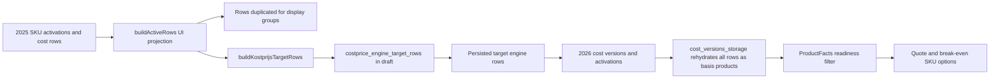
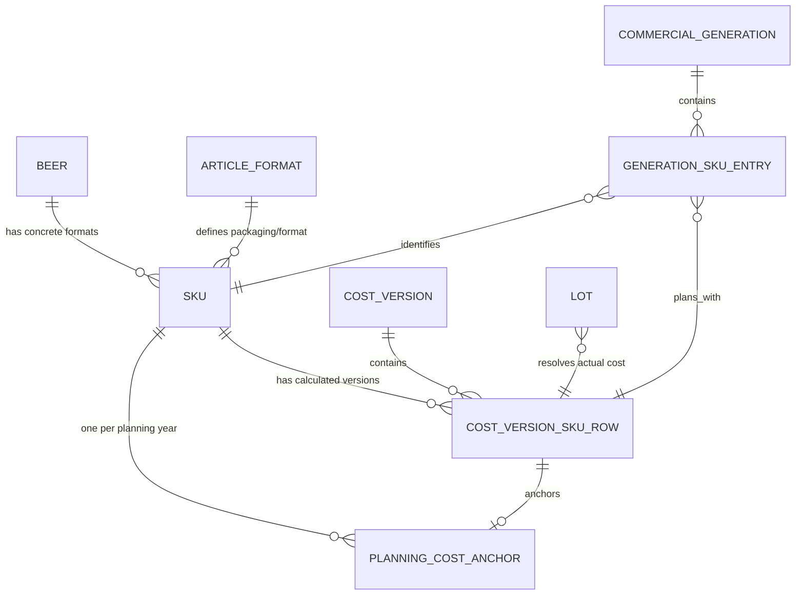

# 16 — Year-transition SKU parity and cost-history analysis

Date: 2026-07-20  
Scope: read-only repository analysis following RF-010A; no application code, schema or persisted data changed.

## Outcome

The roadmap needs an additional protected path before the active-commercial-context resolver or any quote/break-even consumer migration is implemented.

The relational direction is not wholly wrong: `skus` identifies a concrete sellable SKU, `cost_version_sku_rows` stores a cost per version and SKU, and `kostprijs_sku_activations` selects a version per SKU and year. The defect is that the new-year workflow does not consistently use those canonical relations. It constructs target-year business rows from a UI projection, persists UI-derived labels/classifications, and later rehydrates every normalized cost row as a basis product. This can lose the distinction between a bottle, keg, composed box and sellable variant in application reads even when identifiers or historical JSON still exist.

Do not centralize consumers on the present 2026 result yet. First characterize exact source-to-target SKU parity, then introduce a canonical read-only year-transition planner, then reconcile an additive candidate generation. Historical cost versions, invoices, brew moments, LOTs, quotes and actual snapshots must remain untouched.

## Evidence chain

- **Observed:** `NieuwJaarWizard.sourceYearActiveRows` invokes the same `buildActiveRows` function used by the “Actieve kostprijzen” screen and passes its result into `buildKostprijsTargetRows` (`frontend/src/components/NieuwJaarWizard.tsx:1683`, `frontend/src/components/NieuwJaarWizard.tsx:1863`, `frontend/src/components/NieuwJaarWizard.tsx:1877`).
- **Observed:** `buildActiveRows` is presentation-oriented. It computes group labels and then `flatMap`s one source row into one row per display group (`frontend/src/components/kostprijsbeheer/kostprijsBeheerDerivations.ts:384`, `frontend/src/components/kostprijsbeheer/kostprijsBeheerDerivations.ts:560`).
- **Observed:** the new-year calculator prefers the UI row’s `artikelNaam`/`productNaam` over the stored cost-line label and translates a `beer_format` SKU with raw product type `sku` into `basis` (`frontend/src/components/nieuw-jaar/nieuwJaarWizardKostprijsTarget.ts:313`, `frontend/src/components/nieuw-jaar/nieuwJaarWizardKostprijsTarget.ts:318`, `frontend/src/components/nieuw-jaar/nieuwJaarWizardKostprijsTarget.ts:343`).
- **Observed:** those derived rows become persisted `costprice_engine_target_rows` (`frontend/src/components/NieuwJaarWizard.tsx:706`).
- **Observed:** target activation groups persisted engine rows by Beer and selects the first source version for group metadata (`backend/app/domain/dataset_store.py:2002`, `backend/app/domain/dataset_store.py:2012`, `backend/app/domain/dataset_store.py:2062`, `backend/app/domain/dataset_store.py:2076`).
- **Observed:** target snapshots deliberately write `liters_per_product` as `0.0` (`backend/app/domain/dataset_store.py:2202`).
- **Observed:** when cost versions are read, all normalized `cost_version_sku_rows` are injected into `resultaat_snapshot.producten.basisproducten`; `samengestelde_producten` is replaced with an empty list (`backend/app/domain/cost_versions_storage.py:763`–`backend/app/domain/cost_versions_storage.py:790`). This is a read-model overwrite, not proof that the original persisted JSON was deleted.
- **Observed:** quote options use `buildProductFacts(... onlyReady: true)` and omit Beer/formats without positive liters, positive cost and positive channel sell-in (`frontend/src/components/offerte-samenstellen/dataSources.ts:95`, `frontend/src/components/offerte-samenstellen/dataSources.ts:121`, `frontend/src/lib/productFacts.ts:316`–`frontend/src/lib/productFacts.ts:333`).
- **Observed:** RF-010A’s private hash audit found 77 central 2026 rows but only 54 quote/break-even-ready rows, plus 35 activation/version/SKU combinations without a canonical cost row or matching stored result-snapshot row. No numerical source switch has been made.

## Assessment of the reported points

### 1. Juweel shows zero while Tripel has a cost

- **Classification:** user-observed; repository cause partly observed; exact affected database row unknown.
- **Current behaviour:** the active-cost table prints any numeric zero as a formatted currency value and only prints `-` for `null` (`frontend/src/components/kostprijsbeheer/ActiveKostprijzenSection.tsx:243`, `frontend/src/components/kostprijsbeheer/ActiveKostprijzenSection.tsx:290`).
- **Practical problem:** zero currently conflates “valid zero,” “missing/failed calculation” and “not applicable.” Hiding that as `n.v.t.` would conceal a real missing-cost defect when the SKU exists.
- **Approved outcome:** per Beer, default to the planning SKU for `Doos 24 × 33cl` and show the keg planning SKU when it exists. Use distinct states:
  - valid active/planning cost: formatted amount;
  - format does not exist for this Beer: `n.v.t.`;
  - format exists but has no activation: `Niet geactiveerd`;
  - active row exists but cost is missing/non-positive: `Kostprijs ontbreekt` with recovery action.
- **Risk/confidence/action:** high financial/user risk; high confidence in the UI-state defect, medium confidence in Juweel’s underlying row cause. Diagnose through RF-010C, correct data through RF-013C, present through RF-012D.

### 2. “Alles onder de boom” appears multiple times

- **Classification:** user-observed; likely mechanism inferred; exact row multiplicity unknown.
- **Evidence:** composed articles collect every Beer group reachable through BOM components and `flatMap` into each group (`frontend/src/components/kostprijsbeheer/kostprijsBeheerDerivations.ts:470`–`frontend/src/components/kostprijsbeheer/kostprijsBeheerDerivations.ts:565`). Historical variants created before RF-007A may also remain as distinct persisted SKUs.
- **Practical problem:** a display grouping can look like duplicate data and, more seriously, these duplicated display rows are reused by the new-year calculation.
- **Approved outcome:** canonical manifests and calculations contain each `sku_id` once. A UI may intentionally reference one SKU in multiple categories, but it must label that as a cross-reference and never persist the duplicated projection. RF-010C must classify whether the reported repetitions are one SKU in several groups, several legitimate SKUs, or duplicate legacy SKUs; no automatic merge/delete is allowed.
- **Risk/confidence/action:** high workflow risk; high confidence in the projection duplication, low confidence in physical duplicate rows without an authorized item-level data audit.

### 3. Weizen is labelled “Inkoop” before a 2026 purchase

- **Classification:** current label behaviour observed; requested terminology is an approved product clarification.
- **Evidence:** version `type` is mapped directly to `Inkoop` or `Eigen productie`, including rehydrated rows (`backend/app/domain/cost_versions_storage.py:774`–`backend/app/domain/cost_versions_storage.py:780`). Year-transition metadata already records source year and creation path (`backend/app/domain/dataset_store.py:2244`–`backend/app/domain/dataset_store.py:2254`).
- **Approved outcome:** do not overload one field. Display both:
  - cost method/origin: `Inkoop`, `Eigen productie`, `Afgeleid` or `Zelf samengesteld`;
  - version provenance: `Initiële berekening`, `Inkoopfactuur`, `Brouwmoment`, or `Overgenomen en herberekend uit 2025`.
  A future 2027 generation must say `Overgenomen en herberekend uit 2026` until an actual 2027 purchase/brew version exists.
- **Risk/confidence/action:** medium user/audit risk; confirmed. Standardize the resolver output in RF-011A/RF-011C, retain additive lineage in RF-013A/RF-013C, render in RF-012D.

### 4. Show active costs and all variants/history

- **Classification:** approved product requirement; not a current-preservation refactor.
- **Approved outcome:** the active overview groups by Beer and then concrete SKU. It first shows planning formats (`Doos 24 × 33cl`, then keg where applicable) and permits “Alle varianten / historie” expansion. History must distinguish:
  - stable planning-cost anchor;
  - later purchase invoices or brew moments and their LOTs;
  - source year and recalculation lineage;
  - cost method and component breakdown;
  - active/candidate/superseded status.
- **Safety:** this is a read model. It must not reactivate a version, alter a planning anchor or rewrite LOT history merely by viewing it.
- **Risk/confidence/action:** medium UI risk, high financial-context risk; requirement confirmed. Implement only after RF-011A/RF-011B/RF-013B/RF-013C in RF-012D.

### 5. 2026 Blond `Doos 24 × 33cl` is absent from Quote

- **Classification:** user-observed; exclusion mechanism confirmed; exact failing readiness field unknown.
- **Current behaviour:** quote source uses the `onlyReady` product-facts index. A row is hidden when cost, Beer-format liters or channel sell-in is absent/non-positive.
- **Practical problem:** the user receives no direct explanation; the SKU silently disappears.
- **Likely root cause:** the 2026 new-year projection has an incorrect/missing canonical product identity, cost row, liters relation or sell-in relation. The malformed Blond summary strongly correlates with this, but the exact field needs RF-010C evidence.
- **Risk/confidence/action:** high sales/financial risk; confirmed exclusion logic, high-confidence correlation, exact cause unknown. Do not patch Quote with a fallback SKU. Repair target-year canonical parity first, then migrate Quote in RF-012C1.

### 6–7. Blond 2026 summary has wrong basis/composed rows; 2025 summary cannot be compared

- **Classification:** user-observed; read-model cause confirmed.
- **Evidence:** the cost-version loader overwrites the returned historical product sections with all normalized rows under `basisproducten` and an empty `samengestelde_producten` list. `SummaryStep` then combines stored and live rows by product ID/label (`frontend/src/components/berekeningen/steps/SummaryStep.tsx:59`, `frontend/src/components/berekeningen/steps/SummaryStep.tsx:119`–`frontend/src/components/berekeningen/steps/SummaryStep.tsx:151`).
- **Practical problem:** historical dossiers cannot reliably show the original classification, and the target year cannot be visually proven as source SKUs plus only approved target-year value changes.
- **Approved outcome:** expose two separate immutable/read-only representations:
  1. original finalized calculation snapshot/dossier;
  2. canonical normalized per-SKU cost rows used for operational resolution.
  They may be reconciled by ID, but neither representation may overwrite the other in a read API.
- **Risk/confidence/action:** high audit/regression risk; confirmed. Characterize both representations in RF-010C, expose them separately through RF-011C, and add historical comparison in RF-012D. Do not reconstruct and overwrite old snapshots.

### 8. New-year completion should copy the SKU set and recalculate year-sensitive values

- **Classification:** approved business rule.
- **Canonical invariant:** the source-to-target operation is a manifest over stable concrete `sku_id` values, not a copy of UI rows and not creation of a new SKU merely because the year changes.
- **For every included source SKU, preserve:** `sku_id`, Beer relation, format/article relation, SKU kind, BOM/composition identity, sales eligibility and external mapping identity.
- **Allow to change only through named rules:** year, cost-version/generation IDs, year-sensitive input values, calculated cost components, price-strategy outputs, status/timestamps and explicit provenance.
- **Completeness:** target activation is blocked unless every required source SKU has exactly one target manifest row, a valid positive planning cost where applicable, its required liters/format relation, required channel pricing and an explainable lineage. Extra target SKUs must be explicitly classified as newly introduced, non-planning, or invalid.
- **Atomicity:** committing a draft creates a candidate; only a complete validated candidate may become operational. The previous generation remains active on any failure.

## Data-model conclusion

The target model should remain additive and use the existing useful relational concepts:

The current problems are caused by split authority, not by the existence of a SKU-to-cost-row relationship:

- Beer identity is still partly JSON-backed.
- legacy basis/composed datasets, article/BOM data and canonical SKU data coexist;
- finalized snapshot JSON and normalized cost rows are merged destructively in the read model;
- activation represents “current per SKU/year,” but the approved stable first planning anchor is not a separate authority;
- new-year calculation consumes a presentation projection.

Do not replace or delete these sources in one migration. Add authorities, backfill deterministically, dual-read/compare, activate only a complete candidate, then prove old paths unused before RF-014/RF-015 cleanup.

## Revised dependency order

1. **RF-010A:** retain the current active-commercial snapshot as the pre-correction baseline.
2. **RF-010C:** characterize 2025→2026 SKU manifest parity, classification, labels, costs, liters, price readiness and historical snapshot-versus-normalized-row differences. No writes.
3. **RF-010B:** freeze planning-anchor versus actual-LOT semantics using the manifest cases.
4. **RF-011A/RF-011B:** expose read-only active/planning/actual resolvers with explicit incomplete states.
5. **RF-011C:** build a pure, read-only canonical year-transition planner and shadow-compare it with the current UI-derived output. No writes.
6. **RF-013A/RF-013B:** add active generation, canonical identity/anchor and lineage authorities compatibly.
7. **RF-013C:** create and reconcile a new candidate generation automatically; preserve old rows and activate only after exact manifest/commercial completeness checks and product approval.
8. **RF-012C1/C2/C3/C4:** migrate Quote, Break-even, actuals and remaining pricing consumers one at a time after RF-013C.
9. **RF-012D:** refactor “Kostprijs beheren” and historical dossier views using the approved semantic states, default formats and history model.
10. **RF-014/RF-015:** remove only proven unused compatibility code; destructive data cleanup remains separately approved.

## Required RF-010C acceptance examples

- Juweel: `Doos 24 × 33cl` and any keg are individually identified; a missing keg is `n.v.t.`, while an existing zero/missing-cost row fails readiness.
- Blond: source `Doos 24 × 33cl`, bottle and keg relationships are present once in the manifest and retain canonical SKU/format identity in 2026.
- Tripel: currently working rows remain numerically identical.
- Weizen: cost method remains purchase while provenance is “recalculated from source year” until a target-year invoice exists.
- “Alles onder de boom”: every physical SKU is counted once; multiple display references are classified separately from duplicate stored SKUs.
- composed products: BOM identity survives; a composed box is not silently returned as a basis product.
- variants: only explicitly created variants exist; no prefilled or label-derived variants are introduced.
- Quote/Break-even: every required complete target SKU appears in both; exclusions return a typed reason instead of silently disappearing.
- history: the original 2025 finalized snapshot remains readable and is not rewritten during reconciliation.

## Limitations and open verification

- **Observed (RF-010C private read-only audit, 2026-07-20):** 2025 has 66 activation rows and 66 unique SKU IDs; 2026 has 77 activation rows and 77 unique SKU IDs. There are no physical duplicate SKU IDs inside either activation set. The target has no missing source SKU IDs and 11 extra target SKU IDs. Those 11 are not automatically defects: each must be classified as a deliberately introduced 2026 SKU or an invalid extra before candidate activation is designed.
- **Observed:** the structural UI projection has 100 references and six SKU IDs occur in more than one display group. This is UI fan-out, not proof of six duplicate database SKU rows. The executable fixture also invokes the production `buildActiveRows` path and confirms that one composed SKU can currently produce two Beer-group rows.
- **Observed:** 35 target activations have no matching canonical cost row; another 23 have a cost row but do not satisfy all currently active sell-in-channel expectations. These categories are deliberately separate from a non-positive numeric cost, missing liters and a format that is genuinely `n.v.t.`.
- **Observed:** 43 common SKU IDs have a different persisted cost-row label between source and target. Stable SKU identity means a label change alone is not an identity change, but these labels require product validation because the current writer derives them from presentation rows.
- **Observed:** eight common SKU IDs have an identity-field difference and 11 have a source-cost-version lineage mismatch. These remain **Unknown** in meaning and block RF-011C/RF-013C until classified; the committed baseline contains only counts and hashes, not product names, prices or raw IDs.
- **Observed:** 108 of 143 activation/version dossiers differ between the original result snapshot and the normalized read projection. The characterization test confirms that the loader returns normalized rows under `basisproducten` and empties `samengestelde_producten`, while leaving the supplied historical payload object unchanged in memory. This is a read-model defect; it is not evidence that persisted history was deleted.
- **Unknown:** which of the aliased incomplete rows corresponds to the user-reported Blond quote omission. The possible reason families are now frozen (`cost_row_missing`, `cost_non_positive`, `liters_missing`, `sell_in_missing`, identity/lineage), but mapping a private alias back to a named product requires a deliberate local operator report or later safe diagnostic UI.
- **Unknown:** whether the named “Alles onder de boom” repetitions are solely the confirmed UI fan-out, multiple legitimate historical SKUs, old RF-007A-era variants, or a combination.
- **High confidence:** the plan is incomplete without RF-010C/RF-011C/RF-013C/RF-012D because the UI-to-domain dependency and destructive read projection are directly confirmed in code.

## RF-010C implementation and approval record

RF-010C adds no runtime path, database write, schema change, migration, activation, repair or source-of-truth switch. The CI fixture is synthetic and development-shaped. The private capture opens an explicit read-only transaction, emits pseudonymous structure to the local test process, and commits only aggregate counts and SHA-256 fingerprints.

The local private comparison command is intentionally not part of GitHub CI because CI has no private development database. Run it from `frontend/` after loading `backend/.env.local.ps1`, with `RF010C_PRIVATE_CAPTURE_STDIN=1`, and pipe `capture_year_transition_sku_parity.py --source-year 2025 --target-year 2026 --allow-private-development-host --acknowledge-pseudonymous-structure` into the compiled `yearTransitionSkuParity.contracttest.js`. Without `RF010C_PRINT_PRIVATE_MANIFEST=1`, success prints one non-sensitive confirmation line; any fingerprint or reason-count difference fails.

Approval remains pending for:

1. product/data classification of the 11 extra 2026 SKU IDs;
2. investigation of the eight identity differences and 11 lineage mismatches;
3. finance/product acceptance that all 35 missing cost rows and 23 channel-readiness gaps are current defects or explicitly non-operational items;
4. confirmation that stable ID/BOM/external mapping are preserved fields, while only named year-sensitive calculation components may change;
5. acceptance that RF-010B follows RF-010C and must not centralize or repair data.

