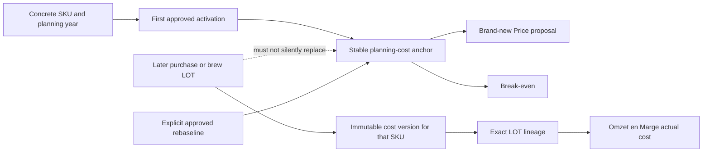

# 17 — Planning-cost anchor versus actual LOT-cost golden snapshot

Date: 2026-07-20
Status: RF-010B implemented as read-only regression protection; fallback and ambiguity policy remains pending human approval.

RF-010B changes no calculation, activation, quote, Break-even, Omzet en Marge, database schema or persisted record. It records both the approved target semantics and today's executable behavior so RF-011B can centralize source selection without hiding a financial difference.

## Outcome

- **Observed:** new Quote options call `buildProductFacts`, which sorts all activations for an SKU/year and selects the latest `effectief_vanaf` (`frontend/src/components/offerte-samenstellen/dataSources.ts:118`, `frontend/src/lib/productFacts.ts:135`–`frontend/src/lib/productFacts.ts:177`). A later activation therefore replaces the earlier planning input today.
- **Observed:** Break-even loads only activation rows whose `effectief_tot` is empty and uses that version's component row (`backend/app/domain/break_even_planning_service.py:780`). It therefore follows the current/open activation, not a separately persisted first planning anchor.
- **Observed:** Omzet en Marge attempts direct LOT cost and exact cost-version LOT before its activation fallback (`backend/app/domain/douano_margin_service.py:628`, `backend/app/domain/douano_margin_service.py:785`, `backend/app/domain/douano_margin_service.py:812`). The executable case proves a January LOT still resolves the January version for a July sale after a May activation.
- **Observed:** when no exact LOT is found, today's resolver returns the as-of latest activation and exposes `fallback_active_sku_cost`, `lot_unmatched_fallback` or `lot_near_match_fallback` (`backend/app/domain/douano_margin_service.py:832`, `backend/app/domain/douano_margin_service.py:2111`–`backend/app/domain/douano_margin_service.py:2134`).
- **Observed:** two cost versions with the same exact `(year, SKU, LOT)` key are not returned as ambiguous. The current index silently retains the highest version number (`backend/app/domain/douano_margin_service.py:354`).
- **Observed:** the storage layer has a unique open activation per `(sku_id, jaar)` and records append-activation events, but there is no separate planning-anchor authority. The full-dataset PUT path also states that activation-row history is not preserved (`backend/app/domain/kostprijs_activation_storage.py:226`, `backend/app/domain/kostprijs_activation_storage.py:264`).
- **Inferred:** simply reusing the current activation table as the future planning SSOT would implement “latest activation,” not the approved “first activation unless explicitly rebaselined” rule.
- **Unknown:** which fallback should become authoritative for a genuinely missing, unknown or ambiguous LOT. RF-010B freezes today's visible outcomes but does not approve them.

## Approved semantic contract



The golden fixture protects these approved cases:

1. January first purchase and May later purchase of the same SKU: January remains the planning anchor; both LOT versions remain actual-cost candidates.
2. A SKU first introduced in May receives its own first anchor.
3. Own production follows the same rule; a later brew of the same format does not silently replace its planning anchor.
4. A newly introduced keg/packaging format receives an independent anchor because it is a different concrete SKU.
5. An exact January LOT wins even when the sale date is after a later activation.
6. Current missing, unknown and near-match LOT fallbacks are captured with typed statuses, not accepted as final policy.
7. An exact LOT collision is reported as ambiguity by the audit even though today's production index silently chooses the highest version.
8. A reopened historical quote retains its saved version and amount; a brand-new quote uses its current source path.
9. The next planning year has an independent first anchor.
10. Only an explicitly classified, approved rebaseline event may replace a first anchor in the target model.

The synthetic fixture is deliberately marked `pending-human-approval`. It contains invented identifiers and invented amounts only.

## Current development baseline

All figures below are **Observed** in the guarded read-only development capture on 2026-07-20 and cover 2025–2026. The committed manifest contains only aggregate counts and SHA-256 fingerprints.

| Evidence | Count | Interpretation |
|---|---:|---|
| Planning SKU/year keys | 143 | One candidate key per current activation |
| Activation rows | 143 | No closed second activation row is retained for these keys |
| Activation events | 146 | Three keys have a repeated event |
| Keys with events for more than one version | 0 | Repeated events do not prove a later cost-version transition |
| First-versus-latest deviations in captured history | 0 | No real later-version case exists in retained 2025–2026 evidence |
| Exact `(year, SKU, LOT)` ambiguities | 11 | More than one cost version can match the same exact key |
| Historical actual snapshots | 6,132 | Orders and invoices in scope |
| Resolved exact LOT | 2,717 | Exact cost-version/direct LOT resolution |
| Resolved LOT alias | 799 | Alias-assisted resolution |
| Explicit LOT fallback | 500 | 37 missing-LOT and 463 unmatched-LOT fallbacks |
| Planning-baseline actual | 680 | Actual row used active SKU cost without requiring LOT |
| Missing cost | 940 | 18 generic missing and 922 missing LOT cost |

The zero captured planning deviation is not evidence that the current implementation satisfies the approved rule. There is no retained key with events for two different versions. The synthetic executable case supplies the absent but required January→May scenario and confirms that Quote and Break-even currently choose May.

The 11 ambiguous exact LOT keys and 940 missing-cost snapshots are blocking deviations for RF-011B. They must be classified; no test or refactor may guess, rewrite or delete them to obtain a green comparison.

## Regression assets

- `frontend/scripts/fixtures/planning-lot-cost.synthetic.golden.json`: invented planning/LOT scenarios and expected current/approved outcomes.
- `frontend/scripts/planningLotCostGolden.contracttest.ts`: invokes production Quote and frontend Break-even readers and freezes their current latest-activation result.
- `tests/test_planning_lot_cost_golden.py`: invokes the production backend Break-even and Omzet en Marge resolver functions for exact, absent, unknown, near and ambiguous LOT cases.
- `scripts/planning_lot_cost_snapshot.py`: pure approved-anchor/deviation/ambiguity audit and domain-separated fingerprints.
- `scripts/capture_planning_lot_cost_snapshot.py`: guarded read-only development capture; it emits no identifiers or commercial values when producing/verifying the committed manifest.
- `frontend/scripts/fixtures/planning-lot-cost.private.fingerprints.json`: aggregate counts and private-development hashes only.

## Commands

CI-safe gates:

```powershell
Set-Location frontend
npm.cmd run test:pricing
Set-Location ..
.\.venv\Scripts\python.exe -m unittest discover -s tests -p "test_*.py"
.\.venv\Scripts\python.exe scripts\check_unittest_discovery.py
```

Private development verification, from the repository root:

```powershell
Set-ExecutionPolicy -Scope Process -ExecutionPolicy RemoteSigned
. .\backend\.env.local.ps1
$env:CALCULATIETOOL_ENV = "development"
.\.venv\Scripts\python.exe scripts\capture_planning_lot_cost_snapshot.py `
  --baseline-commit f875427aa4706964d10742cb0ac2094c2d135ce3 `
  --years 2025 2026 `
  --allow-private-development-host `
  --acknowledge-pseudonymous-structure `
  --verify-manifest frontend\scripts\fixtures\planning-lot-cost.private.fingerprints.json
```

Expected output is one line: `RF-010B private development fingerprint baseline OK; no commercial values emitted`.

## Human decisions before RF-011B

- [x] First approved activation per concrete SKU/year is the default planning anchor.
- [x] A later cost version for the same SKU remains available for actual LOT costing and does not silently replace planning.
- [x] A newly introduced format/SKU receives its own independent first anchor.
- [x] Exact LOT lineage overrides order/invoice date and later planning activations.
- [x] Historical quotes and actual snapshots are not repriced during centralization.
- [ ] Decide whether a missing LOT on a LOT-required product must block the margin row or may use a visibly labelled planning fallback.
- [ ] Decide whether an unknown/near LOT must block until mapped, or may use a separately permissioned and auditable fallback.
- [ ] Confirm that an ambiguous exact LOT always blocks and must never silently choose the highest version.
- [ ] Decide who may explicitly rebaseline planning cost, what reason/evidence is mandatory, and whether Management plus Administrator or Administrator only has that capability.
- [ ] Classify the 940 missing-cost snapshots and 11 exact-LOT ambiguities before any consumer switch or data repair.

## Rollback and next dependency

Rollback removes only the new tests, fixtures, audit helpers and this document. No data rollback or migration exists.

RF-010B completes the technical RF-010 protection package, but finance/product approval remains pending for the unchecked decisions above. RF-011B may introduce a read-only resolver and deviation reporting only after those policies are decided; it must not switch consumers or repair persisted data. Additive planning-anchor and LOT-lineage authority remains RF-013B, with consumer migration later in RF-012C and history UI in RF-012D.
