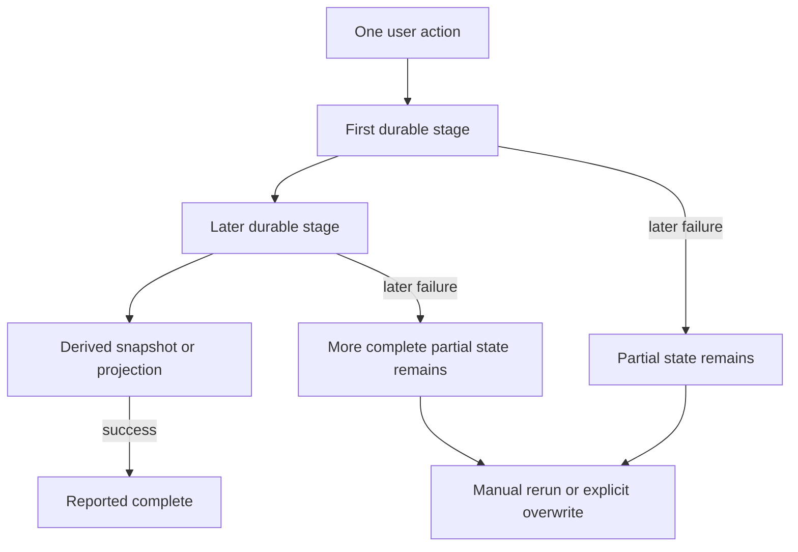

# RF-004 critical workflow characterization

RF-004 is test and documentation work only. It does not approve or change any
partial-failure, concurrency, retry, deletion, overwrite, permission or financial
behaviour described below. PostgreSQL tests inherit the RF-003 fail-closed guard and
can run only against a loopback database whose name begins with
`calculatietool_test_` after explicit opt-in.

## Durable-boundary map

The concrete stage boundaries are:

| Workflow | Current durable units | Injected failure/retry contract | Current decision status |
|---|---|---|---|
| FLOW-004 dataset reconciliation | one HTTP/DB transaction per item; deletes run after creates/updates | second mutation failure leaves the first item committed; earlier conflict prevents later deletes; manual retry converges | Human decision required for business sets. Do not assume one UI save is atomic. |
| FLOW-006 cost finalise/activate | cost version, beer/style PUT, activation, margin snapshot | source-order test freezes version before style before optional activation; an activation survives later snapshot failure; same-version retry creates no second active row/event; a failing activation batch rolls back | Financial/domain owner must decide whether stages become atomic or explicitly resumable. |
| FLOW-008 quote lifecycle | one draft save transaction; allocator reads `MAX + 1` | duplicate submit creates two drafts/numbers; forced concurrent allocation yields one success and one unique conflict; final update is rejected but final delete succeeds | Product decision required for idempotency, ownership and retention. |
| FLOW-010 Douano sync | fetch-all, per-object raw commits, normalised commit, snapshot commit, sync-state commit | page failure writes nothing; Nth raw failure keeps earlier raw rows; snapshot failure keeps raw/normalised rows; rerun converges by external ID | Operations/data owner must validate partial horizon and replay policy. |
| FLOW-012 LOT/import | opening import per row; stock import per batch; legacy LOT row then best-effort projection | Nth opening row leaves earlier rows; retry converges; projection failure is suppressed while primary row persists; the same stock file creates a new batch | Data owner must choose file identity and projection authority. |
| FLOW-014 year close | close snapshot, realised litres, then browser incidental-row reconciliation | critical validation blocks before snapshot; realised-litre failure leaves a closed snapshot; ordinary retry is blocked, explicit overwrite completes; frontend order freezes incidental reconciliation after API close | Highest-risk human decision: current error can coexist with a closed year. |
| FLOW-015 new year | one target-year PostgreSQL transaction; best-effort draft deletion | injected target-stage failure rolls back all markers; source fingerprint conflict stops before writes; successful commit remains when draft deletion fails; draft PUT is last-write-wins | Preserve target-year atomicity. Decide later whether multi-tab draft revisions are needed. |
| FLOW-019 ORS distance | one transaction spans selection, external geocode/route and all cache writes | dry-run writes nothing; matching cache skips rerun; per-company not-found commits a failure status; raised external failure rolls back earlier cache writes | Operations owner decides whether long transaction/pool occupancy remains acceptable. |

## Test ownership

- `frontend/scripts/workflowCharacterization.contracttest.ts` owns FLOW-004 request
  ordering, partial mutations, ETag stop and retry convergence.
- `tests/test_workflow_source_boundaries.py` freezes the two private frontend
  orchestration orders that cannot be invoked without a component test runner.
- `tests/test_workflow_failure_characterization.py` owns mocked external/stage
  failures and last-write-wins draft behaviour.
- `tests/test_workflow_postgres_characterization.py` owns real transaction,
  concurrency, idempotency and partial-state outcomes in unique disposable databases.
- Existing pricing contracts remain the SKU/cost-price numerical baseline. RF-004
  changes no formulas or stored financial representation.

## Observed risks requiring human review

The tests intentionally make these outcomes visible rather than correcting them:

1. A year can already be closed when the close action reports a later failure.
2. A finalized quotation cannot be edited but can be permanently deleted.
3. Identical quote submissions are distinct creates, and concurrent numbering can
   return a raw uniqueness conflict.
4. An older Douano entity version overwrites a newer cached raw object, and missing
   child lines are not removed on rerun.
5. LOT projection failures are suppressed, so the two models can disagree; repeated
   stock files create new import batches.
6. Cost activation can succeed before margin snapshot refresh fails.
7. New-year target writes roll back together, but draft deletion is deliberately
   best effort and same-owner multi-tab draft writes are last-write-wins.
8. ORS keeps a database transaction/connection occupied throughout external calls.

## Out of scope

RF-004 does not add idempotency keys, queues, workflow-run tables, automatic retries,
compensation, revised quote deletion, revised permissions, server-side quote totals,
schema migrations, data cleanup, or UI copy. Those require individual later slices
and the decisions above.
